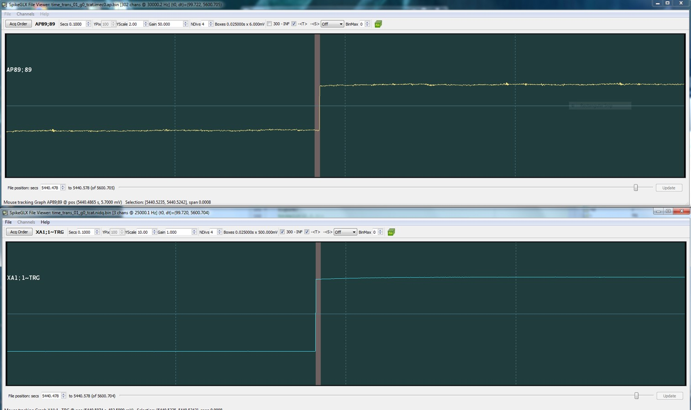
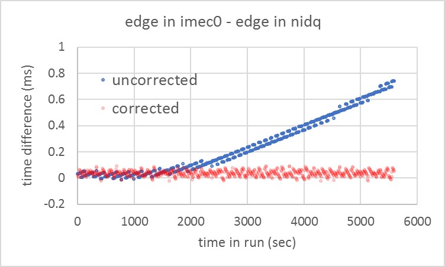

Sync: Aligning with Edges
=================================

## Step 1: Calibrate your clocks

* SpikeGLX can perform calibration runs to estimate the sample rates of NI and imec data streams.
* You should always do this as a first step in obtaining accurate measurements of event time.
* However, sample clocks fluctuate nonlinearly, primarily from local temperature variation.
* Hence, assigning a single rate to a clock that runs for hours will inevitably have some error.

The next figures show the result of recording a common square wave with an NI device,
and with an imec probe. A Pt wire was immersed in buffer alongside the probe.

The screenshots show the SpikeGLX offline trace viewer which uses calibrated
clock rates to align streams against each other.

In the plot you can see progressive deviation of the edges even with calibrated clocks.

### Start of Run

Near the start of the run (t = 64 sec) edge in imec0 stream and NI stream
are aligned in time => error in time estimate is still very small.

### End of Run

Near the end of the run (t = 5440 sec) edge in imec0 stream and NI stream
offset by ~0.7 msec => time estimates off due to imperfect knowledge
of the clock rates.

### Edge Differences Uncorrected

Time differences between the two streams are not perfectly linear with
time in the run => Knowledge of the clock rates is imperfect, and the
clock rates are not completely stable.

## Step 2: Run with active sync enabled

* In SpikeGLX we recommend recording a common 1 Hz square wave in one channel of each data stream.
* The rising edges measure the second-by-second variation in the sampling rate of each stream.
* The variation in rate is small O(0.001 s) compared to the edge spacing O(1 s).
* This allows us to pair up the edges, and use them to convert time from one stream to another.

1. Get the time of an event in stream A as the distance from the nearest previous edge in stream A.
2. Now add that distance to the matched edge in stream B to get the event time in stream B.

This corrects for nonlinear variation at any point in the run, and with an
accuracy of 1 or 2 samples.

The pair of offline helper tools:  **CatGT, Tprime**  do this mapping for you.
Get them [here](https://billkarsh.github.io/SpikeGLX/).

### Edge Differences Corrected

Use the edges of the 1 Hz sync wave – which are known to be simultaneous
in all streams to identify a known matched time in the two data streams.

Translate a time in the “from” stream to the times in the “to” (reference)
stream starting from this known matched edge.

Note: Errors in corrected data are 1 or 2 samples; this is round-off error in ratio of rates.

_fin_

