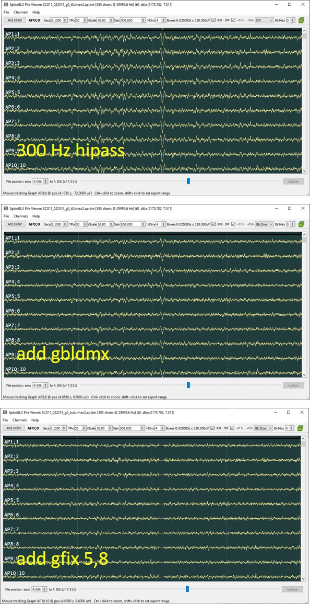

CatGT: Global Demuxed CAR
=================================

## How it works

The -gbldmx option in CatGT applies the same global demux filter available
in the SpikeGLX user interface. This option performs a modified form of
common average referencing, which takes account of the fact that the
channels in a Neuropixels probe are not all sampled simultaneously. Rather,
the channels are split into multiplexed groups, and one channel from each
group is sampled at each tick of the multiplexed data rate. Gbldmx performs
CAR on subsets of channels that are sampled concurrently.

The variation in sampling time can only be seen in very fast transients,
for example licking artifacts:

## Compare to standard CAR

Global average referencing (CAR), which subtracts the average of all channels
from each individual channel, does a poor job at correcting these very
fast transients, because the signal is different for channels sampled
at different times. The following figure compares standard and demuxed CAR:

## RMS noise issues

A potential downside of gbldmx vs. standard CAR is that the calculated
correction is averaged over fewer channels, and therefore more prone
to noise. However, the differences in estimated rms between the two
techniques are very small. Below is example data (courtesy of Susu Chen)
showing estimated rms vs. channel from a Neuropixels 1.0 probe in
mouse thalamus.

## Editing with gfix vs filtering with gbldmx

Global averaging with demux is valuable when the data contain artifacts
with very fast transients. Such artifacts can also be corrected with
CatGT's -gfix option. This cuts fast transients out and replaces them
with zeros so the time span of the data is preserved.

This option is specified as follows: `-gfix=10,8` which in this case
means that, within each demux group, at least 25% of the channels
exceed 10% of full-scale voltage. These timepoints are flagged. After
all other filtering has been applied, the data are edited to replace
a window of time centered on the flagged point with zeros. In this
example, the window span is 8 samples (+/- 4 samples about the artifact).

It does make sense to use -gfix and -gbldmx options together. Editing
removes extreme artifacts completely, while demuxed CAR removes common
background noise at all timepoints, not just at extrema.

## Case for CAR?

In data that does not contain such artifacts, a user may wish to simply
apply the CAR filter implemented in spike sorting programs. This might
be a simpler workflow if CatGT isn't playing any other role, such as
trial concatenation.

## What about LFP?

Neither CAR nor demuxed CAR are recommended when analyzing low freqencies.
The LFP varies slowly over the whole shank, making distant channels a bad
reference for correcting noise.

_fin_

