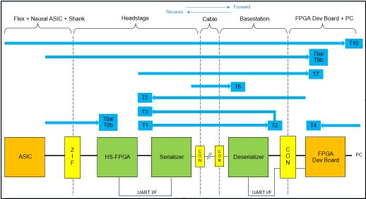

## Built-in Self Tests (BIST)

### Overview



A number of self tests are implemented in the recording system to
debug combinations of subsystems.

```
Terminology:
    HW     = hardware
    SW     = software
    PC     = computer
    FPGA   = microcomputer (one ea. on HS and Xilinx)
    BSC    = base station card (plugged into FPGA)
    HS     = headstage
    PRBS   = pseudo random binary signal
    SerDes = serializer/deserializer
```

* Test T1:    HW heartbeat HS (LED blue)
* Test T2:    HW heartbeat BSC forward (LED blue)
* Test T3:    HW heartbeat HS  reverse (LED green)
* Test T4:    PC <-> Xilinx interconnection
* Test T5:    SW heartbeat HS (LED orange)
* Test T6:    SerDes PRBS test pattern
* Test T7:    HS neural data test pattern
* Test T8a/b: Neural data sync/count & test pattern check
* Test T9a/b: Full neural data sync/count & test pattern check
* Test T10:   Shank/probe -> PC neural data operational test

### T1 (Automatic)

If Xilinx successfully sends power and boot code to HS over the microcoax
cable, the HS FPGA begins sending a 2 Hz heartbeat signal to its own blue
HS LED. Blinking should continue until power is switched off.

### T2 (Automatic)

The HS FPGA also sends the T1 signal over the microcoax to the blue BSC LED
labelled NEURAL_HBEAT, which checks this forward data link.

### T3 (Automatic)

The T2 signal is also sent back from the BSC to the HS green-yellow LED over
the microcoax testing the reverse data link. LEDs from T1, T2, T3 should
blink in unison. T3 terminates when GUI software opens a connection
to the system.

### T4

Tests:

* Loopback test of PC <-> Xilinx ethernet connection.
* Xilinx SDRAM read/write test.
* Xilinx LCD test.

```
Result codes:
  BISTTEST4_SUCCESS        = 0, /**< BIST Test 4 successful */
  BISTTEST4_NO_DEVICE      = 1, /**< BIST Test 4 no device opened */
  BISTTEST4_LED_ERROR      = 2, /**< BIST Test 4 register read/write failure */
  BISTTEST4_DRAM_ERROR     = 3, /**< BIST Test 4 DRAM selftest failure */
  BISTTEST4_LOOPBACK_ERROR = 4  /**< BIST Test 4 data link loopback failure */
```

### T5

Tests HS <-> BSC SerDes link:

* BSC reads/reports the HS board and FPGA versions.
* BSC sends the heartbeat signal to HS orange LED.

```
Result codes:
  BISTTEST_SUCCESS    = 0, /**< BIST Test (started / stopped) successful */
  BISTTEST_NO_DEVICE  = 1, /**< BIST Test no device opened */
  BISTTEST_UART_ERROR = 2  /**< BIST Test UART communication error */
```

### T6

Tests bit error rate of the HS <-> BSC SerDes link by running PRBS
generator for 5 seconds and reporting the bit error count.

```
On starting/stopping T6:
   BISTTEST6_SUCCESS     = 0, /**< BIST Test 6 (started) successful */
   BISTTEST6_NO_DEVICE   = 1, /**< BIST Test 6 no device opened */
   BISTTEST6_UART_ERROR  = 2, /**< BIST Test 6 UART communication error */
   BISTTEST6_SER_ERROR   = 3, /**< BIST Test 6 serializer status at address 0x04
                                does not equal 0x87 */
   BISTTEST6_DESER_ERROR = 4, /**< BIST Test 6 deserializer status at address
                                0x04 does not equal 0x87 */
   BISTTEST6_PRBS_ERR    = 5  /**< BIST Test 6 PRBS_ERR not zero */
```

### T7

Tests connections from HS to serializer to deserializer to Xilinx by sending
multiple test data patterns and checking fidelity. Reports count of trial
patterns, count of errors and which of four SPI data lines had errors
(these are bits 0..3 of the reported error mask).

```
On starting/stopping T7:
  BISTTEST_SUCCESS    = 0, /**< BIST Test (started / stopped) successful */
  BISTTEST_NO_DEVICE  = 1, /**< BIST Test no device opened */
  BISTTEST_UART_ERROR = 2  /**< BIST Test UART communication error */
```

### T8

Tests probe <-> HS link, reporting {adc, sync, counter} error counts on each
of the four SPI data lines during 1 second test intervals.

* The "B" mode tests SYNC and COUNTER errors.
* The "A" mode additionally tests neural data pattern fidelity.

```
On starting/stopping T8:
  BISTTEST8_SUCCESS     = 0, /**< BIST Test 8 started / stopped successful */
  BISTTEST8_NO_DEVICE   = 1, /**< BIST Test 8 no device opened */
  BISTTEST8_UART_ERROR  = 2, /**< BIST Test 8 UART communication error */
  BISTTEST8_RANGE_ERR   = 3, /**< BIST Test 8 SPI line out of range */
  BISTTEST8_DIGCTRL_ERR = 4  /**< BIST Test 8 digital control access failed */

On fetching T8 counts:
  BISTTEST_SUCCESS    = 0, /**< BIST Test (started / stopped) successful */
  BISTTEST_NO_DEVICE  = 1, /**< BIST Test no device opened */
  BISTTEST_UART_ERROR = 2  /**< BIST Test UART communication error */
```

### T9

Tests probe <-> Xilinx link; basically T8 + Xilinx data checking.

* The "B" mode tests SYNC and COUNTER errors.
* The "A" mode additionally tests neural data pattern fidelity.

```
On starting T9:
  BISTTEST9_SUCCESS     = 0, /**< BIST Test 9 started / stopped successful */
  BISTTEST9_NO_DEVICE   = 1, /**< BIST Test 9 no device opened */
  BISTTEST9_DIGCTRL_ERR = 2  /**< BIST Test 9 digital control access failed */

On stopping T9:
  BISTTEST_SUCCESS    = 0, /**< BIST Test (started / stopped) successful */
  BISTTEST_NO_DEVICE  = 1, /**< BIST Test no device opened */
  BISTTEST_UART_ERROR = 2  /**< BIST Test UART communication error */
```

### T10 (Automatic)

Any other errors should be trapped and reported in the usual course of run
configuration and data acquisition.


