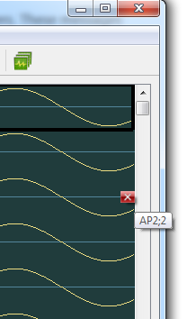

## File Viewer

* View any SpikeGLX output data (`bin`) file.
* Open Shank Viewer to visualize activity on probe.
* Time-lock (`link`) views across data streams.
* Export subsets of the data to new bin or text files.

--------

## Run Anywhere

Compiled SpikeGLX releases contain two executables:

```
    SpikeGLX.exe        Full function, but needs NI-DAQmx software
    SpikeGLX-NISIM.exe  Full Imec function, simulated NI
```

SpikeGLX-NISIM.exe is provided so you can:

* Run Imec acquitision when you don't have/need NI hardware.
* Run the File Viewer anywhere without NI hardware.

--------

## Opening a File Viewer

From main Console window, choose `File/Open File Viewer` then select
any SpikeGLX `bin` file.

You can open several files, one Viewer for each.

>You can view files from different runs at the same time. Linking is
smart and only connects files within the same run.

--------

## File Viewer Titlebar

This shows the name of the open file, its channel count,
the sampling rate, and some useful time information:

* t0 = Seconds elapsed between the start of the run and the first
sample in this file. The first sample received from that stream's hardware
defines T=0.

* dt = Total time span of this file (in seconds).

>Note: Each Viewer is listed in the console `Window` menu. Select
a window here to bring it front.

--------

## Shank Viewer

Click the [Shank Viewer](ShankView_Help.html) button in the upper-left
corner of the File Viewer.

The Shank Viewer averages over the data currently visible in the File Viewer.

Use the `Edit` tab to create new IMRO tables based upon visualized activity.

--------

## Linking (Time Axes)

Linked viewers send messages to each other so actions in one
automatically update the others. These messages are passed:

* Time range changed.
* Time axis scrolled.
* Time selection changed (Shift-click and drag).

To turn linking on, choose Viewer menu item `File::Link (Ctrl+L)`.
The link options dialog is shown. The currrent Viewer's context will
be propagated to the other windows belonging to this run.

You can only link files of the same run. You can only link them if their
`bin` and `meta` files are all stored in the same directory. Said another
way, the path and file base name `myRun_gXXX_tYYY` are the association keys.

--------

## Link Dialog

The Link command always opens a dialog in which you can select which
streams from the current run you want opened. You can independently
specify a list of imec AP files and imec LF files. When the dialog
is closed, all the files (from this run) that are on screen will be
linked.

>Note 1: You can open and link 30 files at the same time **BUT IT WILL BE
SLOW AND NOT VERY USEFUL**. Try a modest number of files.

>Note 2: All the windows that are opened will get the current settings
for filters and so on. Before linking, turn off all unneeded filters,
and set a modest time range so that opening and arranging the new files
will happen reasonably quickly.

--------

## Unlinking

When linking is on, scrolling in one window causes scrolling in other
windows which is normally what you want, but if you're mostly looking
at a particular file it will certainly slow you down. You can scroll
faster like this:

1. Turn linking off (Ctrl+U).
2. Navigate manually (the windows are now independent).
3. Make sure the view of interest is the frontmost window.
4. Turn linking back on (Ctrl+L) in that window; the others
will sync up to it.

--------

## Exporting a Subset of the Data

Open the `Export dialog` by: choosing `File::Export`, or pressing `Ctrl+E`,
or `right-clicking` anywhere in the graph area.

The dialog offers several choices for the range of graphs (channels)
to include and for the time span to include.

The next two sections explain how to graphically specify these selections
**before opening the Export dialog**.

--------

## Selecting Channels to Show or Export

You can remove uninteresting channels from the view in two ways:

1. In the `Channels` menu, toggle that channel off (uncheck it).
2. Hover the cursor (mouse) over the right edge of the desired
graph at its baseline (y=0). A red `X` will appear. Click this
to remove the channel.



Channels can be restored in the Channels menu by toggling them on or
choosing `Show All`.

--------

## Selecting Time Ranges

You can use click-and-drag to graphically select a time range either
to zoom the current view, or to set a range for the export function.

* To zoom, hold down the **Ctrl** key on the initial left-click.
* For export, hold down the **Shift** key as you left-click.

For either type of drag operation the window will automatically scroll
if you move the mouse beyond the right or left edge of the window.

* You may need to wiggle the mouse a bit to make it scroll.
* You don't have to keep the modifier key down after you start dragging.
* You can erase an export range by Shift-left-clicking without dragging.
* The `Status` area at the bottom includes an export selection readout.

--------

## Measuring Time Spans

**Shift** key + **left-click & drag**.

This sweeps out a colored bar that vertically spans across all channels.
The `Status` area at the bottom reads out the width (time span in seconds).
Use this as a straight-edge to see how events line up, or to measure time
offsets between channels.

As above, it's also the way to select a time range for export.

--------

## Right-Clicking

`Right-click` anywhere in the graph area to get a menu of additional
features.

### ShankMap (GeomMap) Operators

The operations in this menu turn on/off channel `used-flags` (u-flags).
The u-flag controls if that channel is included in spatial averaging `-<S>`
filters. Noisy (bad) channels diminish the effectiveness of such filters.

* `ShankMap: Toggle This Chan`: Right-click on a spiking channel,
then select this option to turn that channel off/on.

* `ShankMap: Turn Off List`: A dialog appears to name groups of channels.

* `ShankMap: Restore Original`: Revert to the settings stored in this
file's metadata. This is usually the default settings. For imec probes
the default settings turn off *reference* and *standby* channels.

> **Detail**: Metadata items {`~snsShankMap` and `~snsGeomMap`} are both
data structures that describe where each channel's electrode is located
on the probe surface and contain the channel's u-flag. ShankMaps describe
locations of electrodes as (row,col) indices in a grid. GeomMaps use more
accurate (x,z) coordinates in microns. GeomMaps replace ShankMaps for
imec probes as of SpikeGLX version 20230202.

> **Note**: The FileViewer treats your data as *read-only*. None of the
channel exclusion or filtering results are saved. However, see next note.

> **Note**: Data can be filtered and edited with postprocessing tool
[**CatGT**](https://billkarsh.github.io/SpikeGLX/#catgt). If you specify
a set of channels to exclude (turn off) via the CatGT `-chnexcl` option,
that operation modifies u-flags and alters the ShankMap (GeomMap) stored
in the CatGT output.

### Export

* `Export`: This is a quick way to get the Export dialog after selecting
a time range.

--------

## Setting a Custom File Offset

1. Choose menu item `File::Time Scrolling`.
2. Enter a non-negative value in the `File Offset` box (in seconds).

The value is set as the effective start-time of the file.

For example, when this value is zero (default), to scroll to a point
ten seconds into the file, you would enter ten in the `secs` box under
the graph area. If you entered 50 as the file offset, you would instead
enter 60 into the `secs` box, because 60 is now ten seconds into the file.

>The file offset affects all reported positions and time entry boxes in the
FileViewer and the Export dialog.

--------

## Performance Tips

Navigating is faster if less work is needed to update the view(s).

* Unlink when you don't need it.
* Scrolling gets much faster/smoother as you reduce the time span.
* Try browsing with a short span, then increase it for context.
* Uncheck filters you don't need.
* Try selecting the manual graph updating mode from `File::Time Scrolling`.
(*In this mode you can manipulate the time start/slider controls and graphs
won't redraw until you click the 'Update' button next to the slider*).


_fin_

