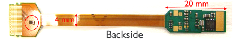

## Working with Broken EEPROMs

### Probe Labeling

* Labels on probes are 11 digits long, for example: `15039707141`
* Labels always start with `1`
* The last digit is the option number
* The middle 9 digits are the serial number, here, `503970714`

### EEPROM Chip

Probes have a tiny EEPROM chip (`circled in red`) containing the probe
serial number, option, and ADC/gain calibration data.



If the chip detaches or breaks then SpikeGLX displays the following
probe info when you click the 'Detect' button in the Devices tab:

* Probe serial# 107...
* Probe option 4

1. Note that true serial numbers start with '5' or '6' and are only 9
digits long, whereas the bogus serial numbers usually start with '1'
and are often longer.

2. Although there are real option 4 probes, a broken EEPROM always
presents as option 4.

The probe can still be used through a manual override feature. First
ask the manufacturer for the calibration file set matching the probe's
11-digit identifier. Then follow the instructions below to command
SpikeGLX to use the files instead of the EEPROM chip.

>**Note: You will have to revisit the 'Force' dialog for this probe
each time you quit and relaunch SpikeGLX**.

### Probe Data Folder

A probe's data folder looks like this:

```
    15039707141\
        Comparator calibration.csv
        Gain correction.csv
        Offset calibration.csv
        Slope calibration.csv
```

### Install a Data Folder

If you need to access a broken probe, get its data folder and drag it
into subfolder `SpikeGLX/_Calibration`.

If you don't see the `_Calibration` subfolder, create it yourself with
exactly that case and spelling.

### Using the Force Features

Click `Detect` on the `Devices` tab when you want to:

* Clear the force-ID flag (shown in the imec message box)
* Clear the skip-calibration flag
* Make a fresh attempt to read data from the EEPROM

Click `Same As Last Time` to keep current flag settings for the next run.

Click `Force...` on the `IM Setup` tab to access data override features:

#### Serial Number Entry

You can type the 9-digit serial number directly into the text box.

Alternatively, you may want to copy the 11-digit name of the `probe data folder`
using Windows File Explorer and paste that into the text box. Use the
`11 -> 9` button to strip that to the middle 9-digit serial number.

#### Skip ADC Calibration

This is not recommended, but available in cases where the probe data
files are corrupt or you just don't have them and still want to use
your broken probe.


_fin_

