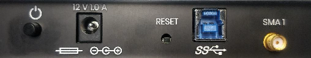
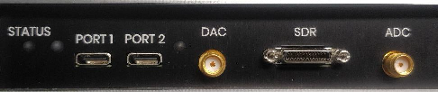
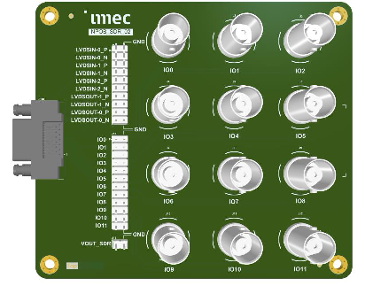

# SpikeGLX OneBox Quickstart

*>> Updated: April 10, 2025 <<*

*>> AO (DAC) and WavePlayer enabled in SpikeGLX <<*

**Topics**:

* [Overview](#overview)
* [Compatibility](#compatibility)
* [Hardware Tour](#hardware-tour)
    + [Back Panel](#back-panel)
        + [Sync](#sync)
    + [Front Panel](#front-panel)
        + [Status lights](#status-lights)
        + [Neural ports](#neural-ports)
        + [DAC connector](#dac-connector)
        + [SDR and breakout board](#sdr-and-breakout-board)
        + [ADC connector](#adc-connector)
        + [Voltage levels](#voltage-levels)
* [Driver Installation](#driver-installation)
* [SpikeGLX_NISIM](#spikeglx_nisim)
* [Assign a Slot](#assign-a-slot)
* [Data Streams, Files, Formats](#data-streams-files-formats)
* [Sample Rate, Calibration](#sample-rate-calibration)
* [Configure a Run](#configure-a-run)
* [Troubleshooting](#troubleshooting)

# Overview

## What is it?

Think of the OneBox as three **separate** function units in one tidy package:

1. **Neural unit**: The 2 headstage ports work just like PXI-based ports.
2. **ADC unit**: There are up to 12 analog input (ADC) channels for aux signals.
3. **DAC unit**: There are up to 12 analog output (DAC) channels.

>*There are 12 I/O channels in total; each configurable as an input or output.*

>*The DAC unit also has an analog [**WavePlayer**](WavePlan_Help.html).*

## Setup

It's easy to set up; basically three steps:

1. Plug the box into a USB 3.0 (or higher) port.
2. Install a required FTDI driver.
3. Assign it a slot number.

There are additional details below, and in the Imec technical document:

[*OneBox Technical User Manual.*](https://www.neuropixels.org/_files/ugd/328966_d832528710f14d6e85938d5de06e83cc.pdf)

--------

# Compatibility

- Any computer that can run SpikeGLX can run a OneBox if it has a USB port
(USB 3.0 or higher). Laptops are fine.
- OneBox ports work just like the ports in PXIe basestations and can run
any model of headstage/probe.
- You can run several OneBoxes in the same SpikeGLX run.
- You can run a mixture of OneBoxes and PXIe basestations (a.k.a. "modules")
in the same SpikeGLX run.
- CatGT and TPrime work with OneBox data files.

>Notes:
>
>(1) Follow the guidelines called "Screen Saver and Power Settings" in the
SpikeGLX UserManual [here](UserManual.html#screen-saver-and-power-settings).
Especially, set `USB settings/USB selective suspend setting: Disable`.
>
>(2) If you have any issues:
>
>- Your OneBox ADC stream sample rate is very different from the 30300 Hz
expected rate,
>- You can't detect probes,
>- You're getting messages that the Gate configuration timed out,
>- You're not getting samples at run start,
>- You're getting pop errors or missing samples.
>
>Then you should try other ports on this or another PC.

--------

# Hardware Tour

## Back Panel



- Power switch
- Power connector
- USB connector
- SMA 1 (Sync)

### Sync

#### Overview

Sync in SpikeGLX works by sending a single common 1 Hz square wave to one
channel of each recording data stream. The rising edges of this wave can
then be matched across streams, and paired edge offsets can be used to map
event times from one stream to another (our TPrime tool does this mapping).
We discuss how this works in detail
[here.](https://billkarsh.github.io/SpikeGLX/help/syncEdges/Sync_edges/)

Quick notes about OneBox:

* A OneBox can either source or receive the square wave via SMA 1.
* OneBoxes can record both probe data streams and ADC channel streams.
* All the streams on a given OneBox share the same Sync square wave.
* That square wave is recorded in bit #6 of each stream's SY channel.

#### Port and voltage

**SMA 1** on the back panel is the OneBox SYNC port. It uses 0-5V TTL
(digital) signals. This functions like the SMA connector labeled **TRIG**
on the front of a PXI basestation, which also uses 0-5V TTL signals.

>Note: The OneBox 'SMA 1' and PXIe 'TRIG' are each in parallel with a
1 KOhm pull-up resistor. If that's too low an impedance for your signal
source, then you can add a 100 Ohm pull-down resistor to your output
line to compensate (add a BNC T with a 100 Ohm resistor on the unused
branch between signal and shell).

#### Sync output

In SpikeGLX, on the Configuration dialog `Sync` tab, you can select one
device in the run for Sync output. This can be a separate pulser device,
an NI device, a OneBox, or a PXI module. All the other devices in that run
must then be wired to receive that common shared Sync signal.

#### Sync input

Any OneBox in a run that is not selected for Sync output is automatically
programmed for Sync input, so that it will record the common shared Sync
signal being generated by the selected output device. (This is also how
PXI modules are programmed: they are inputs any time they are not an output).

#### Wiring

PXI modules all live in the same PXI chassis and share signals among
themselves using the chassis backplane. So only one PXI SMA should be
connected whether bringing signals in or out of the chassis as a whole.
However, if using more than one OneBox, there is no backplane connecting
these, so you will need to cable up the SMA 1 connector of each OneBox
in the run.

>IMPORTANT: Sync is automatically shared among all the probes and ADC
streams running on a given OneBox. However, there has to be a Sync signal
in order to share it. If you are running a single OneBox and nothing else,
you should select the OneBox as the Sync output source on the `Sync` tab
of the Configuration dialog: this will generate the shared signal. Since
all the streams are being run by this single device, there is no need to
connect wires to **SMA 1**.

#### Non-sync input

When Sync is disabled on the `Sync` tab, imec PXIe modules and OneBoxes are
programmed for input at their Sync SMA. This allows you to record whatever
5V TTL signal you wish in the SY channels (bit #6) of each of the recorded
data streams.

## Front Panel



- OneBox status
- Neural ports (with status lights)
- DAC connector: access to analog output channel-0.
- SDR breakout connector
- ADC connector: access to analog input channel-0.

### Status lights

Briefly, (soft blinking or steady):

* Off: not powered
* Red: not connected, or idle
* Green: connected
* Blue: acquiring, normal
* Purple: acquiring, buffer overflow

### Neural ports

Plug imec headstage(s) here. They work just like the ports in PXI modules.

### DAC connector

This front panel SMA is an alternate means to access analog output channel-0,
if you don't want to use the breakout board.

### SDR and breakout board

The accessory breakout board provides access to the 12 analog input/output
channels. Each channel can individually be configured for input (ADC) or
output (DAC). In SpikeGLX OneBoxes are configured on the `OBX Setup` tab
of the main `Configuration` dialog.

Connect it using the provided SDR (shrunk delta ribbon) cable. Note that
one end of the cable is labeled "Camera Side" but that does not matter in
this application: **Both ends are equivalent**.



Access the 12 ADC/DAC channels using the BNC connectors or by attaching your
custom ribbon cable to the connector block labeled "IO."

>*Ignore the pins labeled "LVDS." They are reserved for future expansion
by imec and are currently unimplemented.*

### ADC connector

This front panel SMA is an alternate means to access analog input channel-0,
if you don't want to use the breakout board.

### Voltage levels

**Sync**

* Sync input/output is accessed on the back panel at "SMA 1."
* Sync uses 0-5V TTL signals.

**ADC inputs**

* ADC channels are accessed via the breakout board or the front panel ADC SMA.
* ADC voltage is selectable using the Obx tab in SpikeGLX: +/- {2.5, 5, 10} V.

>*Notes:*
>
>1. *The ADC inputs have pull-up resistors. The voltage will appear to be
between 1.7 and 2 V on an unconnected channel. However, connected channels
will read accurately.*
>
>2. *The ADC channels are multiplexed, so there may be a small crosstalk voltage
visible on any unconnected channel. That's not an issue if you are not using that
channel, but you can make that disappear by either connecting an input to that
channel or by putting a 50-ohm terminator on it.*

**DAC outputs**

* DAC channels are accessed via the breakout board or the front panel DAC SMA.
* DAC voltages are settable during a run using the SDK remote interface: range +/- 5V.
* DAC channel-0 can be programmed via SpikeGLX to output analog waveforms.
* DAC voltages are initialized to zero when a run starts.

--------

# Driver Installation

You need the proper FTDI driver (**1.3.0.10**) for the FT601 chip in
the OneBox...

>Note that the OneBox does not use enclustra drivers. Those are only
needed for PXIe basestations.

## First, Check What's There Now

1. Connect power supply to the OneBox, turn it on.
2. Connect it to the PC using the included USB 3.0 cable.
3. Open Windows Device Manager: Right-click Windows Start button >>
select "Device Manager" from menu.

If you see an entry like this, you will install a driver for the first time.


If you see an entry like this,


then check the version of the driver: Right-click >> Properties >> Driver tab.
If the version is 1.3.0.10, you're done. If the version is either earlier or
later, you must update it.

>*Update: SpikeGLX version 20241001 and later will automatically check the
driver version and if there is an issue, will inform you what version you
have and what version you need. This is simpler than consulting the Device
Manager.*

## Getting the New Driver

1. Go to the [FTDI D3XX driver download site](https://ftdichip.com/drivers/d3xx-drivers/).
2. Select the latest Windows X64 driver as shown.


The downloaded file looks like "FTD3XXDriver_WHQLCertified_v1.3.0.10.zip."

3. Unzip the download.
4. In the Device Manager, update whichever entry you saw before: Right-click
>> Update driver >> Browse my computer for drivers >>
select your folder >> Next.
5. Check for success: Entry in Device Manager now looks like Fig 2.

>Note: Once a driver is installed, the Device Manager entry like Fig 1. will
vanish. That's normal.

--------

# SpikeGLX_NISIM

Release downloads come with two executables:

- **SpikeGLX.exe**: Runs {imec probes, OneBox, NI, FileViewer}, but you need
to install NI DAQmx drivers to run it.
- **SpikeGLX_NISIM.exe**: Runs {imec probes, OneBox, FileViewer} but not NI
hardware. Does not need NI drivers.

--------

# Assign a Slot

Some motivating background. In the beginning you bought a PXI basestation
module which you installed into a **slot** of your PXI chassis. Each module
had four **ports** for plugging in headstages. The imec software references
the headstages in your system according to their **(slot,port)** address.

Now come OneBoxes, which are basestations in a new package, although these
have two instead of four ports. As we said, you can do a run with some
probes plugged into PXI modules and some in OneBoxes. In order to unify
things, we ask you to assign a slot number to each OneBox. This way, you
are running a set of headstages of given **(slot,port)** regardless of
where you plugged them in.

Note that each OneBox has a serial number (a.k.a. OneBox ID) sticker on the bottom. Use
the **Configure Slots** button on the **Devices** tab of the Configuration
dialog to assign a slot for that SN, and set other preferences.

Follow these steps:

1. Click `Configure Slots` in the upper-left of the Configure dialog `Devices` tab.


2. Click on the table row with your OneBox ID (SN) to select it.


3. In the controls below the table:

* Select any slot number in the range [20,31].
* Show either 1 or 2 docks per port.
* Click OK.


This adds new rows into the main `Probes` table in the `Devices` tab.
In this example there are three added rows:

* We asked for 1 dock/port, so there are two new rows for probes:
(slot,port,dock) = (21,1,1) and (21,2,1).

* Row (21,XIO) lets you configure this OneBox's ADC/DAC options.


Full details on the `Configure Slots` dialog are [here](Slot_Help.html).

--------

# Data Streams, Files, Formats

Please read the User Manual, but at least read these sections:

* [Data Stream](UserManual.html#data-stream)
* [Supported Streams](UserManual.html#supported-streams)
* [Channel Naming and Ordering](UserManual.html#channel-naming-and-ordering)
* [File Format](UserManual.html#file-format)

The reading will explain in general how output files are named and their
data formats. Here we follow that up with an illustrative example.

**Simple Example**

Suppose you want to run with your OneBox (slot 21 in this example):

* One 2.0 probe (saving all channels)
* One ADC stream (saving analog channels 0,1 and the digital channel)

If you named the run `AAA`, this would result in four data files:

* AAA_g0_t0.imec0.ap.bin
* AAA_g0_t0.imec0.ap.meta
* AAA_g0_t0.obx0.bin
* AAA_g0_t0.obx0.meta

The probe data files are the same as you would get from running that probe
in a PXI module:

* The file name reflects your chosen run name `AAA`.
* The name encodes the gate and trigger program indices `g0_t0`.
* The name encodes the logical probe index in the `Probes` table `imec0`.
* For our NP 2.0 probe, the `ap` files contain full-band data. Note
that dual-band probes (such as NP 1.0) can generate both `ap` and `lf` files.
* Each timepoint (sample) of the binary data contains 385 16-bit words:
the 384 neural `AP` channels, followed by one `SY` word containing error
and sync data bits.
* The meta file records all details of the hardware and settings that were
used to record this data stream.

Probe recording is the same whether you plug into OneBox or PXI!

However, the `Obx` data file type is specific to OneBox. It's the SpikeGLX
way of naming ADC streams recorded with OneBoxes. The first OneBox enabled
in the table gets label `obx0`, the next is `obx1` and so on. In our example:

* The file name reflects your chosen run name `AAA`.
* The name encodes the gate and trigger program indices `g0_t0`.
* The name encodes the logical OneBox index in the `Probes` table `obx0`.
* Each timepoint (sample) of the binary data in this example contains 4
16-bit words: the 2 selected analog `XA` channels, followed by a single `XD`
word containing the digital channel data, followed by one `SY` word containing
error and sync data bits.
* The meta file records all details of the hardware and settings that were
used to record this data stream.

--------

# Sample Rate, Calibration

## Rates

Probes plugged into OneBox work the same as in PXI. The governing sample
clock for probes is in the headstage. All headstages run asynchronously,
so you will need to align/sync data from different probes as always.
The nominal sample rate for a headstage is ~30 KHz.

The ADC input sample clock is in the OneBox. It runs at ~30303 Hz
(non-adjustable).

## Calibration

As always, we recommend doing a calibration run for all the components you
will enable in the same run. This greatly improves the estimates of their
relative rates and will enable TPrime to accurately align the streams even
for very long recording sessions. Find full discussion of synchronization
and calibration here:

* [User Manual](UserManual.html#synchronization).
* [Sync tab help](SyncTab_Help.html).

>Note that clock rates vary with temperature so no single rate can
accurately account for drift over long time spans. Rather, the common shared
sync wave is used by the TPrime postprocessing tool to precisely determine
current relative drift at any point in a run, provided the same sync wave
edges can be paired. A good calibration ensures edges can be paired
(based on the nominal rate estimate) even for long run durations. See help
document:
[Sync: Aligning with Edges.](https://billkarsh.github.io/SpikeGLX/help/syncEdges/Sync_edges/#sync-aligning-with-edges)

--------

# Configure a Run

## Probes

To run a probe with a OneBox:

1. Plug the probe into a headstage and plug the headstage into a OneBox port.
2. Check the `enable` checkbox for that (slot,port,dock) in the `Probes` table.
3. Click `Detect`.
4. Visit the `IM Setup` tab to set addition parameters for the probe.

Detailed instructions for the `IM Setup` tab are [here](IMTab_Help.html).

## XIO = ADC and/or DAC

To record an ADC input stream from a OneBox, or to enable its DAC output
features:

1. Connect your input and output signals to a OneBox breakout board.
2. Check the `enable` checkbox for that (slot,XIO) in the `Probes` table.
3. Click `Detect`.
4. Visit the `Obx Setup` tab to set ADC and DAC parameters.

Each of the 12 channels can only be an input or an output.

>*It is flagged as an error if the same channel is in the ADC and the DAC list.*

>**CAUTION: You might damage the OneBox or other equipment if you
cross-connect inputs to outputs.**

Detailed instructions for the `Obx Setup` tab are [here](OBXTab_Help.html).

>Don't forget to also:
>
> - Set up your sync cabling
> - Enable Sync on the `Sync` tab
> - Set your gate and trigger modes
> - Name the run on the `Save` tab

> Set DAC voltages during a run using the **SDK remote interface** functions.
 That's a separate add-on package you
can learn about [here.](https://billkarsh.github.io/SpikeGLX/#remote-controlscripting-sdk)

> Learn about using the **WavePlayer** features [here](WavePlan_Help.html).

--------

# Troubleshooting

If the OneBox stops talking, say, you see this error on clicking `Detect`:

```
error 30 'USB IO error: 32'
```

It's usually simple to recover:

1. Quit SpikeGLX.
2. Cycle power to the OneBox.
3. Relaunch SpikeGLX and try the operation again.

>Sometimes just cycling OneBox power is enough.


_fin_

