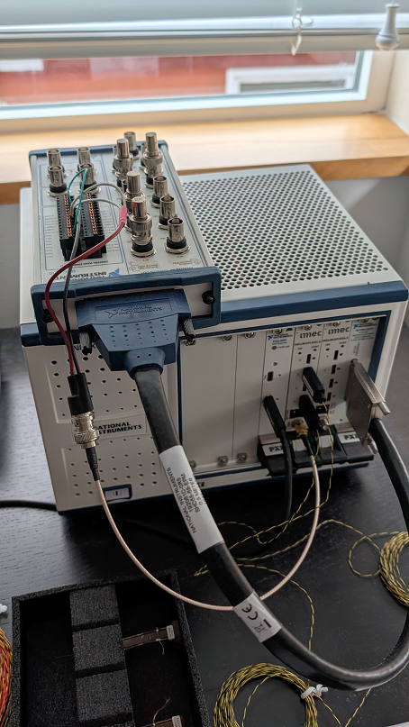

# SpikeGLX PXIe Quickstart

*>> Updated: September 18, 2025 <<*

**Topics**:

* [Overview](#overview)
    + [What is PXIe?](#what-is-pxie)
        + [Mix and Match](#mix-and-match)
        + [Restrictions](#restrictions)
* [Compatibility](#compatibility)
* [Hardware Tour](#hardware-tour)
    + [Slots](#slots)
    + [Sync](#sync)
        + [Port and voltage](#port-and-voltage)
        + [Sync output](#sync-output)
        + [Sync input](#sync-input)
        + [Wiring](#wiring)
        + [Non-sync input](#non-sync-input)
    + [Imec status lights](#imec-status-lights)
* [Set-up](#set-up)
    + [Drivers: controller and chassis](#drivers-controller-and-chassis)
    + [Drivers: DAQmx](#drivers-daqmx)
    + [NI-MAX Application](#ni-max-application)
    + [Drivers: enclustra](#drivers-enclustra)
    + [SpikeGLX_NISIM](#spikeglx_nisim)
    + [SpikeGLX: update firmware](#spikeglx-update-firmware)
    + [SpikeGLX: configure slots](#spikeglx-configure-slots)
* [Data Streams, Files, Formats](#data-streams-files-formats)
* [Sample Rate, Calibration](#sample-rate-calibration)
* [Configure a Run](#configure-a-run)
* [Troubleshooting](#troubleshooting)

# Overview

## What is PXIe?

A PXIe chassis is basically an extension of the PCIe bus in your computer.

Before PXIe, you added expander cards directly into a workstation.
A PXIe chassis adds extra slots and a convenient housing to hold plug-in
PXIe "modules." This is a flexible and tidy way to interface computers to
laboratory equipment.

> IMPORTANT: Never insert/remove modules when a PXIe chassis is powered on.

### Mix and Match

PXIe is an industry standard covering:

* Component voltages.
* Chassis backplanes (how signals are shared on the chassis bus).
* Plug-in module physical shape, dimensions, connectors.
* Chassis-PC controller modules.
* Cables.

You can mix and match components {controller, chassis, cards (modules), cables}
from different manufacturers and they should mostly work together. There
are some rules, though:

### Restrictions

**imec cards**

The imec Neuropixels base-station modules will function with any PXIe
components. So you can buy controllers and chassis from anybody.

**Auxiliary I/O cards**

SpikeGLX speaks to I/O modules using a National Instruments (NI) library
called **DAQmx**, and this is unique to NI modules. You can only use NI
I/O modules, but they can plug into non-NI chassis and controllers. 

* Get your controller and chassis anywhere.
* Get non-neural I/O cards only from NI.

**More than 5 imec cards**

Generally, a PXIe backplane bus is organized into segments. Slots 1-6 are
on segment 1, slots 7-12 are on segment 2, and 13-18 live on segment 3.
These bus segments do not inherently talk to each other unless configured
to do so in software. SpikeGLX does that using a chassis control package
called NI-VISA, which is part of the NI Platform Services driver set. We
do not know if this will work with very wide chassis from non-NI makers.
So at present, if you need to run imec modules in more than five slots,
we advise getting an NI chassis so the NI-VISA command set will definitely
work.

## Setup

Consult this guide to:

1. Install drivers for controller and chassis.
2. Install DAQmx drivers for NI I/O cards.
3. Install enclustra drivers for imec module(s).
4. In SpikeGLX, load firmware onto imec module(s).
5. In SpikeGLX, click 'Configure Slots' to set up imec module(s).

--------

# Compatibility

- You can have at most one PXIe chassis, but that can have many card slots.
Daisy chaining of chassis is not supported at this time.

- A Thunderbolt-based controller can be used with a Thunderbolt-equipped laptop.
That allows a very compact and portable setup. The limitation is that laptops
are not suitable for running very large numbers of probes. That should be done
on a workstation equipped with higher power CPU, larger power supply and
better cooling system.

- For a workstation computer you should avoid Thunderbolt controllers.
In our experience, Thunderbolt has connection stability issues in general,
but it is much worse on workstations where Thunderbolt seems to be an
afterthought. We've discussed what to purchase based on probe count
[here.](https://github.com/billkarsh/SpikeGLX/blob/master/Markdown/SystemRequirements_PXI.md)

- You can run a mixture of OneBoxes and PXIe basestations in the same SpikeGLX run.

- DAQmx talks to any NI card {PXIe, PCIe, USB}. That is, you are not limited
to using an NI I/O card that plugs into a chassis. 

--------

# Hardware Tour

 
## Slots

The figure shows an NI 1071 chassis. It has 4 slots, all of them are
populated here:

1. Thunderbolt controller module. Note that the chassis controller is
special in that it **MUST** be in slot #1. It does not matter which slots
you use for any the other modules. There are two Thunderbolt connection
ports on this controller and it doesn't matter which one you use, the other
will be unused. Note too that chassis come with slot blank-off plates. You
should place these over any unused slots to optimize chassis cooling.

2. Imec module. A probe is plugged in at port 1, and another at port 3.
It doesn't matter which ports you use and which are empty (except for
quad-base), you just have to tell SpikeGLX where you actually plug in
probes by checking those boxes in the Probe table. Also note that there
is an SMA cable attached at 'TRIG' which runs to the NI breakout box sitting
on top of the chassis. It is vital that each recording device gets wired with
the common sync wave.

3. Imec module. Note especially that nothing is connected to the sync SMA
connector. It is vital that **ONLY ONE** imec module SMA is connected. All
the other imec modules will share the signal on the backplane. Connecting 
more than one SMA creates beat patterns which corrupt the signal. That rule
applies whether the single SMA is configured for sync output or input. All
other imec modules in the same chassis will automatically share that signal.

4. NI 6341 multifunction I/O module. This module is cabled to an NI BNC 2110
breakout box that provides convenient terminals to connect I/O signals. You
can see that some unused BNC connectors have 50-ohm terminator caps applied.
This suppresses crosstalk on unused channels. Unlike the imec modules, NI
devices **DO NOT** get sync signals on the backplane. Rather, we added a
cable from slot 2 to the NI breakout box to manually share the sync signal.

## Sync

### Overview

Sync in SpikeGLX works by sending a single common 1 Hz square wave to one
channel of each recording data stream. The rising edges of this wave can
then be matched across streams, and paired edge offsets can be used to map
event times from one stream to another (our TPrime tool does this mapping).
We discuss how this works in detail
[here.](https://billkarsh.github.io/SpikeGLX/help/syncEdges/Sync_edges/)

Quick notes about imec PXIe modules:

* A module can either source or receive the square wave via SMA 'TRIG.'
* Only one module in the chassis can be the designated source or receiver.
* Modules can record both probe data streams and the single digital SMA.
* All the streams on a given module share the same Sync square wave.
* All the imec modules in the chassis share the same Sync square wave.
* That square wave is recorded in bit #6 of each stream's SY channel.

### Port and voltage

**SMA TRIG** on the module front panel is the SYNC port. It uses 0-5V TTL
(digital) signals.

>Note: The OneBox 'SMA 1' and PXIe 'TRIG' are each in parallel with a
1 KOhm pull-up resistor. If that's too low an impedance for your signal
source, then you can add a 100 Ohm pull-down resistor to your output
line to compensate (add a BNC T with a 100 Ohm resistor on the unused
branch between signal and shell).

### Sync output

In SpikeGLX, on the Configuration dialog `Sync` tab, you can select one
device in the run for Sync output. This can be a separate pulser device,
an NI device, a OneBox, or a PXIe module. All the other devices in that run
must then be wired to receive that common shared Sync signal. If you select
an imec module as output (generator) you don't have to run wires to the other
imec modules in the chassis because the backplane already connects them.
But you have to run wires to each OneBox and to any NI device.

Likewise, if you selected NI or a OneBox as the generator, you'd have to run
a wire to the NI device if using that, and run a single wire to one (and
only one) of the imec modules in the chassis. You specify which imec module
is getting the input wire on the `Sync` tab.

### Sync input

Any imec module or OneBox in a run that is not selected for Sync output is
automatically programmed for Sync input, so that it will record the common
shared Sync signal being generated by the selected output device.

### Wiring

PXIe modules all live in the same PXIe chassis and share signals among
themselves using the chassis backplane. So only one PXIe SMA should be
connected whether bringing signals in or out of the chassis as a whole.
However, if using more than one OneBox, there is no backplane connecting
these, so you will need to cable up the SMA 1 connector of each OneBox
in the run.

### Non-sync input

When Sync is disabled on the `Sync` tab, imec PXIe modules and OneBoxes are
programmed for input at their Sync SMA. This allows you to record whatever
5V TTL signal you wish in the SY channels (bit #6) of each of the recorded
data streams.

## Imec status lights

**Main**

* Off: not powered
* Red: not connected
* Green: connected
* Blue: acquiring, normal
* Purple: acquiring, buffer overflow

**Each port**

* Off: not connected
* Red: not configured
* Green: configured, active

--------

# Set-up

Work through these sections in the order given.

## Drivers: controller and chassis

Start with the hardware:

1. Power everything off.
2. If using a PXIe-PCIe link, install the PCIe card in the PC.
3. Install the controller module in chassis slot #1.
4. Install all other modules in the chassis.
5. Install blanking plates in unused slots.
6. Power on the chassis.
7. Power on the PC.

>Notes:
>
> 1. For some chassis models, the chassis power is under control of the
> PC. When the PC starts up the chassis will automatically start up too.
>
> 2. Some chassis have manual power control. For these, start the chassis
> first, then the PC.
>
> 3. For Thunderbolt, start the PC and chassis separately, then when both
> are running, connect the cable. This may cause everything to freeze (Blue
> Screen of Death). Just try again if that happens.

Follow manufacturer recommendations for installing drivers your specific
controller and chassis:

>Notes:
>
> 1. If it seems like you don't need drivers at all, it's probably because
> Windows has installed a default driver for you. We nevertheless advise seeking
> the current recommendations from the vendor. Generally, the most recent version
> is a good choice.
>
> 2. For any installer, go with the default options.
>
> 3. However, if you get a choice, we advise that you **DO NOT** select
> automatic updates for your hardware. Once you have a working set of
> drivers it is best to keep using that version. It isn't necessary to
> have the latest version, and the updater may interrupt data acquisition
> runs at very inopportune times.

**Keysight**

* [Controller](https://www.keysight.com/us/en/support/software-download-center.html?q=PXI+controller)
* [Chassis](https://www.keysight.com/us/en/support/software-download-center.html?q=PXI+chassis)

> You're looking for 'PXIe Chassis Family Drivers.'

**ADLink**

* [Chassis](https://www.adlinktech.com/Products/downloadarea?Key=PXI%20Chassis&lang=en)

> Click on the 'Drivers' link for your chassis model, but generally, you're
looking for something called 'ADLink PXI Platform Services.'

**National Instruments (NI)**

* [NI Platform Services](https://www.ni.com/en/support/downloads/drivers/download.pxi-platform-services.html)

## Drivers: DAQmx

Using NI I/O devices to add supplementary non-neural channels to your
experiment is completely optional. SpikeGLX will work with multifunction
I/O S-series 61XX, M-series 62XX, X-series 63XX devices, and with digital-only
653X devices. Moreover, you can use PXIe, PCIe or USB devices, though USB is
slower and should be avoided for new purchases.

Regardless of the NI device model and format you will need NI DAQmx drivers
to run it from SpikeGLX:

* [DAQmx](https://www.ni.com/en/support/downloads/drivers/download.ni-daq-mx.html)

## NI-MAX Application

NI-MAX is a GUI application that lets you Inspect and test your NI hardware
and software, like a fancy NI control panel. It will be installed automatically
if you install either 'NI Platform Services' or 'DAQmx.'

It's not essential to have this, but it's kind of informative. When your
NI hardware is configured properly, you will see your NI chassis listed
on the left and you will see your NI controller and any NI cards shown
"under" the chassis, meaning they are identified as being installed inside
the chassis. That's reassuring.

This software only recognizes NI parts. Other brands of chassis and
controller don't show up here, and importantly, **imec cards do not show
up here**. That's normal.

## Drivers: enclustra

The imec modules require driver software from 'enclustra.' Get that from
our download site [here](https://billkarsh.github.io/SpikeGLX/#pxi-enclustra-drivers)
and follow the included instructions.

## SpikeGLX_NISIM

Release downloads come with two executables:

- **SpikeGLX.exe**: Runs {imec probes, OneBox, NI, FileViewer}, but you need
to install NI DAQmx drivers to run it.
- **SpikeGLX_NISIM.exe**: Runs {imec probes, OneBox, FileViewer} but not NI
hardware. Does not need NI drivers.

Continue set-up using the SpikeGLX app that suits you.

## SpikeGLX: update firmware

From time-to-time imec updates the API software that GUI programs like
SpikeGLX and Open Ephys use to talk to the hardware. Each version of the
imec API is designed to work with certain versions of the firmware loaded
in the PXIe module.

When you click 'Detect' SpikeGLX will test if the firmware has the correct
version. If not, you will be instructed to use menu item Tools::Update
Imec PXIe Firmware, to install the firmware included in your SpikeGLX
download package. Follow the instructions in that dialog to perform this
step.

## SpikeGLX: configure slots

The last part of setting up your PXIe-based system is to choose which PXIe
slots you want to display in the big `Probe` table on the `Devices` tab
of the Configuration dialog. That's the table showing all the places you
can plug in your probes.

1. On the `Devices` tab, click `Enable Imec`.
2. In the imec box, click `Configure Slots`.
In the dialog's table, there is a row for each PXIe slot, and each OneBox.
3. Click on a PXIe slot to select it.
4. In the controls below the table, select to either hide this slot, or,
display it with either 1 or 2 dock/port.
5. Repeat for each slot.
6. Click 'OK.'

Generally, NP 1.0-like headstages only have 1 dock per port, meaning you
can only plug one probe into those headstages. So in the table we can keep
things simpler by only showing one dock per port. That works great if you
only use 1.0 parts.

However, 2.0 headstages generally can take two probes, so they have two
docks. You have to be able to say whether you plugged into dock 1 or dock 2,
so you need those options to be available in the `Probe` table. So you need
2 docks/port in this case.

Full details on the `Configure Slots` dialog are [here](Slot_Help.html).

--------

# Data Streams, Files, Formats

Please read the User Manual, but at least read these sections:

* [Data Stream](UserManual.html#data-stream)
* [Supported Streams](UserManual.html#supported-streams)
* [Channel Naming and Ordering](UserManual.html#channel-naming-and-ordering)
* [File Format](UserManual.html#file-format)

The reading will explain in general how output files are named and their
data formats. Here we follow that up with an illustrative example.

**Simple Example**

Suppose you want to run with your PXIe components:

* One 2.0 probe (saving all channels)
* One NI stream (saving analog channels 0,1 and digital lines 0-4)

If you named the run `AAA`, this would result in four data files:

* AAA_g0_t0.imec0.ap.bin
* AAA_g0_t0.imec0.ap.meta
* AAA_g0_t0.nidq.bin
* AAA_g0_t0.nidq.meta

**Probe files**:

* The file name reflects your chosen run name `AAA`.
* The name encodes the gate and trigger program indices `g0_t0`.
* The name encodes the logical probe index in the `Probes` table `imec0`.
* For our NP 2.0 probe, the `ap` files contain full-band data. Note
that dual-band probes (such as NP 1.0) can generate both `ap` and `lf` files.
* Each timepoint (sample) of the binary data contains 385 16-bit words:
the 384 neural `AP` channels, followed by one `SY` word containing error
and sync data bits.
* The meta file records all details of the hardware and settings that were
used to record this data stream.

Probe recording is the same whether you plug into OneBox or PXIe!

**NIDQ files**:

* The file name reflects your chosen run name `AAA`.
* The name encodes the gate and trigger program indices `g0_t0`.
* Each timepoint (sample) of the binary data in this example contains 3
16-bit words: the 2 selected analog `XA` channels, followed by a single `XD`
word containing the digital channel data.
* The meta file records all details of the hardware and settings that were
used to record this data stream.

--------

# Sample Rate, Calibration

## Rates

The governing sample clock for probes is in the headstage. All headstages
run asynchronously, so you will need to align/sync data from different
probes. The nominal sample rate for a headstage is ~30 KHz.

NI devices have programmable sample rates. You will configure your desired
rate in the `NI Setup` tab of the Configure dialog.

## Calibration

As always, we recommend doing a calibration run for all the components you
will enable in the same run. This greatly improves the estimates of their
relative rates and will enable TPrime to accurately align the streams even
for very long recording sessions. Find full discussion of synchronization
and calibration here:

* [User Manual](UserManual.html#synchronization).
* [Sync tab help](SyncTab_Help.html).

>Note that clock rates vary with temperature so no single rate can
accurately account for drift over long time spans. Rather, the common shared
sync wave is used by the TPrime postprocessing tool to precisely determine
current relative drift at any point in a run, provided the same sync wave
edges can be paired. A good calibration ensures edges can be paired
(based on the nominal rate estimate) even for long run durations. See help
document:
[Sync: Aligning with Edges.](https://billkarsh.github.io/SpikeGLX/help/syncEdges/Sync_edges/#sync-aligning-with-edges)

--------

# Configure a Run

## Probes

To run a probe with an imec PXIe module:

1. Plug the probe into a headstage and plug the headstage into an imec module.
2. Check the `Enable Imec` checkbox to enable the big `Probes` table.
3. Check the `enable` checkbox for that (slot,port,dock) in the `Probes` table.
4. Click `Detect`.
5. Visit the `IM Setup` tab to set addition parameters for the probe.

Detailed instructions for the `IM Setup` tab are [here](IMTab_Help.html).

## NI I/O Device

To enable recording from an NI module:

1. Connect your input and output signals to the NI breakout board.
2. Check the `Enable NI-DAQ` checkbox to enable NI input features.
3. Click `Detect`.
4. Visit the `NI Setup` tab to set additional NI parameters.

Detailed instructions for the `NI Setup` tab are [here](NITab_Help.html).

>Don't forget to also:
>
> - Set up your sync cabling
> - Enable Sync on the `Sync` tab
> - Set your gate and trigger modes
> - Name the run on the `Save` tab

**NI Output**

Some NI I/O devices are capable of generating output signals. Generally,
output features are managed by remote scripting and *NOT* in the Acquisition
Configuration dialog:

> Set digital outputs and/or DAC voltages during a run using the
**SDK remote interface** functions. That's a separate add-on package you
can learn about [here.](https://billkarsh.github.io/SpikeGLX/#remote-controlscripting-sdk)

> Learn about using the **WavePlayer** features [here](WavePlan_Help.html).

--------

# Troubleshooting

You have a Thunderbolt controller link which has stopped talking.
In that case:

1. Power cycle the chassis.
2. Quit/restart SpikeGLX.
3. Try again.

If you can't connect to the imec modules it may be that the enclustra
drivers need to be reinstalled. This happens often when Thunderbolt
needs to be restarted:

1. Open Device Manager.
2. Right-click on enclustra entry having a yellow triangle.
3. Choose 'Disable' from the pop-up menu.
4. Repeat for each such entry.
5. In the Actions menu, select 'Scan for New Hardware.'
6. That's it.

If you don't have the 'Scan for New Hardware' menu item, then un/plug the
Thunderbolt cable and try again.

_fin_

