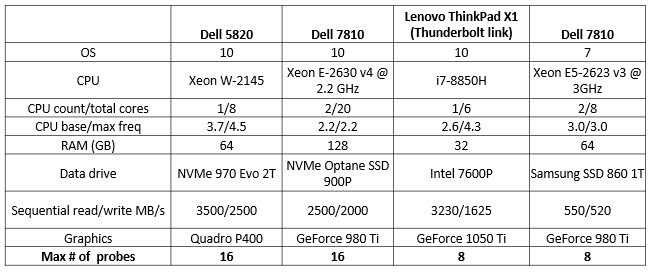

## System Requirements for PXI

### Overview

**What parts do I need for imec/Neuropixels experiments?**

From Neuropixels.org, you need:

* Probe(s)
* Head stage(s)
* Cable(s)
* PXI base-station module(s)

You also need a PXI chassis setup:

* Chassis
* Controller module
* Controller PC card
* Controller link cable

You also probably want to collect non-neural data:

* PXI multifunction IO module

And you need a computer capable of running your system.

Computer requirements depend upon the number of probes and other signals
to be acquired in an experiment. Heavy use of the visualization tools
during acquisition are an additional burden. Since a single computer
specification won't cover all uses of SpikeGLX, we give some rough
guidelines and examples of systems we have tested.

This document also covers options for acquisition of non-neural data
channels and what we know about different chassis options.

#### New Computer Purchase Guidelines

The following are what we think you should purchase if buying a new
desktop machine for this application.

__Up to 8 probes, plus NI channels:__

* Windows 7 or 10, 64-bit
* NI Platform Services 18.5 or later
* NI-DAQmx 18.6 or later
* Minimum 6 cores (Passmark rating > 13000)
* Minimum 3.5 GHz
* Minimum 16GB memory
* Graphics Card: Nvidia GeForce 1060 or better (see, e.g. Passmark ratings for video cards)
* Dedicated data drive (SSD or NVMe, 500+ MB/s)
* PCIe 8X slot for the PXIe controller

__Up to 16 probes, plus NI channels:__

* Windows 7 or 10, 64-bit
* NI Platform Services 18.5 or later
* NI-DAQmx 18.6 or later
* Minimum 8 cores (Passmark rating > 18000)
* Minimum 3.5 GHz
* Minimum 32GB memory
* Graphics Card: Nvidia GeForce 1060 or better (see, e.g. Passmark ratings for video cards)
* Dedicated data drive (NVMe 2000+ MB/s write rate)
* PCIe 8X slot for the PXIe controller

Notes

* GeForce cards require PCs with 400W power supplies
* Google '_model_name_ passmark' (e.g. W-2145 passmark)
* The data drive should be distinct from the system drive

#### Testing Existing Hardware

In SpikeGLX select menu item `Window\Run Metrics` to display a window
of performance measurements that provide some insight on whether the system
is running comfortably or struggling to keep up.

#### Our Test Computer Systems

The following are systems we've tested in our lab. These are not
recommendations (most of the hardware is no longer available);
they are illustrations of working systems.

More work needs to be done to better understand which system attributes
are the most significant.

#### Non-neural auxiliary channels

Imec BS cards have no non-neural input channels, except for a single SMA
connector that SpikeGLX uses to synchronize the card with other devices.
However, SpikeGLX can record concurrently from the imec cards and from
an additional multifunction or digital IO device to cover physiological
data and trial marking signals. Neural and non-neural data are tightly
synchronized.

>SpikeGLX can actually operate two cards **provided they have identical
model numbers**. We are treating such a pair as a single device with
double the channel capacity.

SpikeGLX has these requirements for the non-neural device:

1. It must be an NI device that we can talk to via DAQmx (a general
purpose device programming language for NI hardware).

2. It must be an M-series (62XX), S-series (61XX), X-series (63XX),
or digital IO (653X) device.

>Note: As of version 20190305 SpikeGLX can read up to 32 digital lines
per device (previously limited to 8). Also, be aware that only a device's
'waveform' digital lines can be programmed for high sample rate input.
You'll have to look at the device spec sheet to see the count of
waveform lines. Digital device support is added as of version 20190413.

We have direct experience with these:

* PCI-based 6221 (M)
* PCI-based 6133 (S)    (16 MS FIFO tested)
* PXI-based 6133 (S)    (16 MS FIFO tested)
* PXI-based 6341 (X)
* PXI-based 6363 (X)
* USB-based 6366 (X)
* PXI-based 6535 (digital)

Some models (S and some X) have a feature called 'simultaneous sampling'
which means each input channel gets its own amplifier and ADC. This allows
the device to sample all its channels in parallel at the advertised maximum
sample rate, for example, 2.5 mega-samples/s/channel for the 6133. Moreover,
there is no crosstalk between the channels. That's what makes these models
very capable and very expensive. This is a must when using a Whisper
multiplexer which samples all AI channels at 800 kHz.

When doing multichannel acquisition, non-simultaneous-sampling devices
such as the 6221 use a multiplexing scheme to connect inputs to the
single amplifier/ADC unit in quick succession. The fastest you can drive
such a device depends upon how many channels you want to sample. It's
`R0/nChans`: R0 is the advertised maximum sample rate (250 KS/s for
the 6221). Be aware that switching from channel to channel at this rate
does not allow the amplifier to fully settle before the next input is
connected to it, hence, there will be some crosstalk (charge carryover).
To avoid that issue, run at a lower maximum sample rate given by:
`1/(1/R0 + 1E-5)`. For the 6221 example, you should sample no faster
than `71428/nChans`.

USB-based devices such as the 6366 can't use DMA data transfers, so have
lower effective bandwidth and higher latency than PCI or PXI devices. Go
ahead and use it if you already have one. However, don't use these for
digital input channels: The combination of low transfer rates and a very
small digital FIFO buffer make digital buffer overruns fairly common.

The X-series strike a balance between high sample rate (limited by settle
time) and high channel count. The 6363 has 32 AI and 32 waveform DI channels.
The 6341 has 32 single ended AI and 8 waveform DI channels for half the
price. Remember that AI channels can equally well read analog and TTL inputs.

#### Breakout Box and Cable

Your NI module will talk to the world via a high density multi-pin connector,
so you'll also want a breakout box (connector block) and cable that works
with your module. Browse here for
[NI multifunction IO](https://www.ni.com/en-us/shop/select/pxi-multifunction-io-module)
devices. Click on a table entry and a `View Accessories` button will appear.
There are easier to use options like the BNC-2110 that provide BNCs for the
most often accessed channels, and the SCB-68A that offers only screw terminals
but is more versatile because you can access all channels.

#### PXI Chassis

>BTW: Plural of chassis is also chassis.

We've successfully used these chassis with both imec BS modules and with
an NI PXI-6133 multifunction IO module:

* NI 1082 (8 slots)
* NI 1071 (4 slots)
* ADLink PXES-2301 (6 slots)

>What you need to know about the ADLink chassis is that it is very
attractively priced and well made, but the PXI-6133 didn't work with
this chassis right out of the box. That's because the routing of signals
from one internal terminal to another over the chassis backplane is very
slightly different. We adapted SpikeGLX to work around this and it
seems fine now with all of the NI cards mentioned here.

#### PXI Controllers

We've tested these remote control modules (Chassis <-> PC) links:

* NI PXIe-8398 (16 GB/s)
* NI PXIe-8381 (4 GB/s)
* NI PXIe-8301 (2.3 GB/s Thunderbolt)
* ADLink 8638  (4 GB/s)

These mix and match in in our chassis without compatibility issues. At this
time we can offer these additional remarks:

* The 8398 may well be overkill. It did everything asked of it, up to 16
probes, which is the maximum we tested to, but it is very costly, uses
up a PCI Gen 3 slot, and its thick cable is very unwieldy. In fact, the
cable is heavy enough to worry that it might not hold securely in the device
connectors which are somewhat flimsy.

* The 8381 and 8638 also performed perfectly in all tests out to 16 probes.
This is what we recommend at present. They are more affordable, small, and
need only Gen 2 slots.

* The Thunderbolt controller could only be tested in a laptop, which was
quite capable for a laptop (the Thinkpad X1 in the table above), but we
could only achieve stable performance up to 8 or perhaps 10 probes. We do
not know if the laptop or the link is the limiting factor. More below.

* Having over a month of experience running with Thunderbolt we find that
the link to the chassis tends to be dropped, and, the enclustra drivers
are no longer recognized, after about 6 hours. That seems to be the case
whether the machine is idle or is doing a run. We will have NI look into
the situation, but we can not endorse this configuration for now.

We don't feel comfortable with less than 4 GB/s controllers for now.

>**$$$ Savings!! $$$**: Most people should be buying the 8381 controller
option. You'll need three parts for that: {PXI-8381 for the chassis,
PCIe-8381 for the PC, MXI-Express cable to connect those}. You can save
money by buying those as a bundle (3m cable length) by typing part number
`782522-01` into a search box at the NI web site.

#### Simplified NI Shopping List

We resisted recommending specific parts as long as possible, but people
keep asking what to buy, so here it is, the basic NI parts list for
those who will not be using a Whisper, and need "just a few" extra
channels besides the imec data.

| Item                                   | Part Number   | $US     |
| -------------------------------------- | ------------- | ------- |
| **Chassis:**                           |               |         |
| >>> PXIe-1071 chassis                  | 781368-01     | 1095.00 |
| >>> US power cord                      | 763000-01     | 0010.00 |
| **Controller:**                        |               |         |
| >>> PXIe-8381 module                   | _782362-01_   | 1341.00 |
| >>> PCIe-8381 card                     | _782361-01_   | 1341.00 |
| >>> MXI-Express cable 3m               | _782317-03_   | 0246.00 |
| >>>>>>> **$$$ OR, 3-piece bundle $$$** | **782522-01** | 2571.00 |
| **Multifunction IO:**                  |               |         |
| >>> PXIe-6341 module                   | 781052-01     | 1176.00 |
| >>> BNC-2110 breakout box              | 777643-01     | 0423.00 |
| >>> SHC68-68-EPM Shielded Cable 2m     | 192061-02     | 0158.00 |

* Prices do not include service contracts.
* All required software is free.

_fin_

