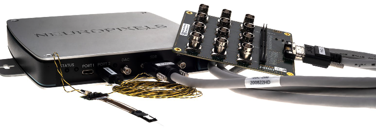
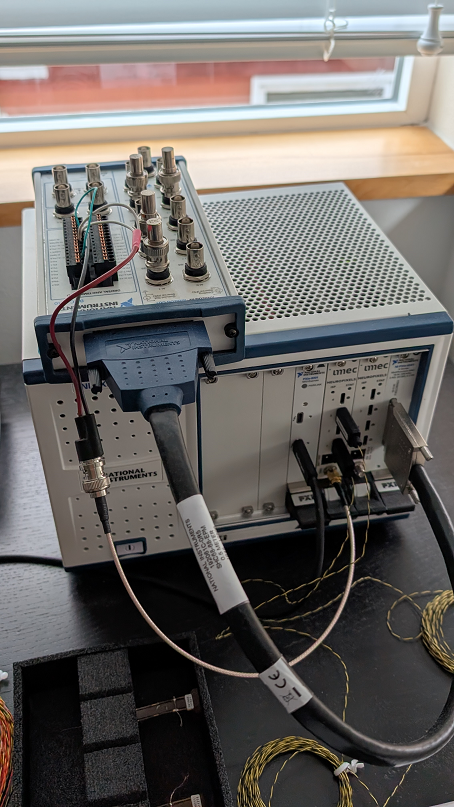

## System Requirements for Neuropixels

**>> Updated: July, 2025 <<**

What's new:

* Expanded acquisition computer specs.

--------

**Table of Contents:**

* [Acquisition Hardware Overview](#acquisition-hardware-overview)
    * [Common Parts](#common-parts)
    * [Two Recorder Options](#two-recorder-options)
        * [OneBox Overview](#onebox-overview)
        * [PXI Overview](#pxi-overview)
    * [PXI: Testing and Details](#pxi-testing-and-details)
        * [PXI: Chassis Details](#pxi-chassis-details)
        * [PXI: Controller Details](#pxi-controller-details)
        * [PXI: Simplified Shopping List](#pxi-simplified-shopping-list)
    * [NI: Multifunction IO](#ni-multifunction-io)
        * [NI: Breakout Box and Cable](#ni-breakout-box-and-cable)
* [Computing Overview](#computing-overview)
    * [Two Steps, Two Computers](#two-steps-two-computers)
    * [Online Computer](#online-computer)
        * [Windows OS](#windows-os)
        * [Intel vs AMD](#intel-vs-amd)
        * [Is My Current Computer Good Enough?](#is-my-current-computer-good-enough)
        * [WorkStation vs Laptop](#workStation-vs-laptop)
        * [RAM](#ram)
        * [Acquisition CPU](#acquisition-cpu)
        * [Acquisition GPU](#acquisition-gpu)
        * [Drive](#drive)
        * [Slots and Ports](#slots-and-ports)
        * [Settings and Behavior](#settings-and-behavior)
        * [Thunderbolt](#thunderbolt)
        * [Test Performance](#test-performance)
    * [Spike Sorting Computer](#spike-sorting-computer)
        * [CPU](#cpu)
        * [Graphics Card (GPU)](#graphics-card-gpu)

--------

## Acquisition Hardware Overview

**What parts do I need for imec/Neuropixels data acquisition experiments?**

You'll always need probes, headstages and cables. Those parts then plug
into a recording system, and for that, you currently have two major options
as we will discuss here.

### Common Parts

From [imec](https://www.neuropixels.org/), you always need:

* Probe(s)
* Headstage(s)
* 5m cable(s)

> *Note: The above parts can break or wear out, so buy some
extras as backups/replacements.*

> Schematic: animal --> probe --> headstage --> cable --> recorder -->
acquisition computer.

### Two Recorder Options

As of October 5, 2024 imec began selling OneBoxes, so you now have two
options for your recording system:

1. **OneBox**: OneBox (imec)
2. **PXI**: PXI Chassis (3rd party) + module(s) (imec, 3rd party)

**Why OneBox might be better than PXI**:

* Already includes a 12-channel non-neural recorder.
* Fewer parts needed to get started.
* Less expensive to get started.
* Easier purchasing (single vendor).
* Smaller and lighter.
* Quieter (no fans).

**Why PXI might be better than OneBox**:

* Cheaper if already own PXI chassis.
* More expandable.
* Higher bandwidth, higher capacity.
* Only way to run very large probe counts.
* Only way to run future NXT (NP3) 1536-channel probes.

> *1536-channel quad-base probes (NP2020) are coming 2025 and CAN run in
either PXI or OneBox. However, 1536-channel NXT probes are a super compact
model that is not expected before 2027 and requires PXI.*

### OneBox Overview



OneBoxes ship as all-inclusive kits, for about 3600 euro:

* OneBox recording device with:
    * 2 headstage ports
    * 12 analog IO aux (non-neural) channels
* Power supply
* USB 3.0 Cable
* Breakout cable
* Breakout card to access aux channels

Notes:

* OneBox connects to PC by USB 3.0, no additional controller is needed.
* You can run 2 OneBoxes concurrently, doubling capacity.
* Running more than two has not been tested yet.
* You can run OneBoxes and PXI in the same run.
* You can run OneBoxes together with an additional NI {PXI, PCI, USB} device.

### PXI Overview



PXI systems require several components purchased from different vendors:

**For neural recording**:

Chassis components can be purchased from {NI, ADLink, Keysight}. These parts
follow the PXI standards and can interoperate.

* PXI chassis
* PXI-computer controller "link"
* PXI base-station module (from: imec):
    * 4 headstage ports
    * 1 TTL (1-bit) input aux channel

**For aux (non-neural) channels**:

You almost certainly want to add another card for non-neural channels.
SpikeGLX talks to these devices with NI DAQmx drivers, so they must
be purchased from NI. NI offers many cards with different capabilities.
Higher channel counts and/or higher sampling rates cost more.

* NI multifunction IO card
* NI breakout cable
* NI breakout box

PXI Notes:

* You can only run 1 chassis.
* You can run as many as 8 imec base-stations in one large chassis.
* You can run 2 identical NI IO cards, doubling aux channel capacity.
* The NI device(s) do not have to be PXI, we can read {PXI, PCI, USB} models.

--------

## PXI: Testing and Details

HHMI/Janelia does extensive testing of acquisition hardware. Here we
summarize results and recommendations.

### PXI: Chassis Details

>BTW: Plural of chassis is also chassis.

We have tested a variety of **NI** and **ADLink** components at Janelia,
running up to 32 probes + 8 NI channels to discover any limitations. Other
users have reported success with **Keysight** models.

Bandwidth is the most important PXI specification:

* 2 GB/s handles **at least** 32 probes + NI.
* 250 MB/s handles **a maximum** of 8 probes + NI.

### PXI: Controller Details

We've tested these remote-control modules (Chassis <-> PC) links:

* NI PXIe-8398 (16 GB/s)
* NI PXIe-8381 (4 GB/s)
* NI PXIe-8301 (2.3 GB/s Thunderbolt 3)
* ADLink 8638  (4 GB/s)

These mix and match in in our chassis without compatibility issues. At this
time we can offer these additional remarks:

* The 8398 may well be overkill. It did everything asked of it, but it is
very costly, uses up a PCIe Gen 3 x16 slot, and its thick cable is very
unwieldy. In fact, the cable is heavy enough to worry that it might not
hold securely in the device connectors which are somewhat flimsy.

* The 8381 and 8638 also performed perfectly in all tests out to 32 probes.
This is what we recommend at present provided you can source these parts in
a timely fashion. They are more affordable, small, and need only
PCIe Gen 2 x8 slots.

* The 1073 chassis has a built-in 250 MB/s remote controller (link) which
we've tested and works fine for at most 8 probes. You can't (and don't need
to) buy any other controller. This requires at least a PCIe Gen 1 x1 slot.

* The 1083 chassis has a built-in Thunderbolt 3 remote controller (link)
which we've tested and works fine at 32 probes. You can't (and don't
need to) buy any other controller.

### PXI: Simplified Shopping List

We resisted recommending specific parts as long as possible, but people
keep asking what to buy, so here it is, the basic NI parts list to run
16 headstages plus NI. At the time we compiled this list, Thunderbolt-
based options were more readily available than other controller types.

| Item                                   | Part Number   | $US     |
| -------------------------------------- | ------------- | ------- |
| **Chassis:**                           |               |         |
| PXIe-1083, 5-slot integrated chassis   | [787026-01](https://www.ni.com/en-us/search.html?pg=1&ps=10&q=787026-01)     | 2590.00 |
| Thunderbolt 3 type-C cable 2m          | 785607-02     | 132.00  |
| US power cord                          | 763000-01     | 19.00   |
| **Multifunction IO:**                  |               |         |
| PXIe-6341 module                       | [781052-01](https://www.ni.com/en-us/support/model.pxie-6341.html)     | 2104.00 |
| BNC-2110 breakout box                  | [777643-01](https://www.ni.com/en-us/shop/accessories/products/terminal-block.html?skuId=33800)     | 631.00 |
| SHC68-68-EPM shielded cable 2m         | [192061-02](https://www.ni.com/en-us/support/model.shc68-68-epm.html)     | 190.00 |

* Available (but we haven't tested): [ADLink 4-slot integrated Thunderbolt 3 chassis](https://www.adlinktech.com/Products/PXI_PXIe_platform/PXIChassis/PXES-2314T?lang=en).
* Available (but we haven't tested): [NI 1090 2-slot integrated Thunderbolt 3 chassis ~$1700US](https://www.ni.com/en-us/shop/model/pxie-1090.html?srsltid=AfmBOooAtkrHkpBzqG9WcCe0kjUhZbP_4M_zso3lJKJXQxH8iK-tv6uy).
* You can buy the Thunderbolt 3 cable and power cord anywhere; they're not special.
* Prices do not include service contracts.
* All required software is free.

--------

## NI: Multifunction IO

NI multifunction IO devices can be used together with either OneBox-
or PXI-based setups.

Imec PXI BS cards have no non-neural input channels, except for a single
SMA connector that SpikeGLX uses to synchronize the card with other devices.
However, SpikeGLX can record concurrently from the imec cards and from
an additional multifunction or digital IO device to cover physiological
data and trial marking signals. Neural and non-neural data are tightly
synchronized for all recording setups.

>SpikeGLX can actually operate two cards **provided they have identical
model numbers**. We are treating such a pair as a single device with
double the channel capacity.

SpikeGLX has these requirements for the non-neural device:

1. It must be an NI device that we can talk to via DAQmx (a general
purpose device programming language for NI hardware).

2. It must be an M-series (62XX), S-series (61XX), X-series (63XX),
or digital IO (653X) device.

>Note: SpikeGLX can read up to 32 digital lines per device. However only
a device's **'waveform' digital lines** can be programmed for high sample
rate input. You'll have to look at the device spec sheet to see the count
of waveform lines. When you click `Detect` on the `Devices` tab of the
Configuration dialog, the NI box reports the number of available lines,
e.g., 'DI[8].'

We have direct experience with these:

* PCI-based 6221 (M)
* PCI-based 6133 (S)    (16 MS FIFO tested)
* PXI-based 6133 (S)    (16 MS FIFO tested)
* PXI-based 6341 (X)
* PXI-based 6363 (X)
* USB-based 6366 (X)
* PXI-based 6535 (digital)

Some models (S and some X) have a feature called 'simultaneous sampling'
which means each input channel gets its own amplifier and ADC. This allows
the device to sample all its channels in parallel at the advertised maximum
sample rate, for example, 2.5 mega-samples/s/channel for the 6133. Moreover,
there is no crosstalk between the channels. That's what makes these models
very capable and very expensive. This is a must when using a Whisper
multiplexer which samples all AI channels at 800 kHz.

When doing multichannel acquisition, non-simultaneous-sampling devices
such as the 6221 use a multiplexing scheme to connect inputs to the
single amplifier/ADC unit in quick succession. The fastest you can drive
such a device depends upon how many channels you want to sample. It's
`R0/nChans`: R0 is the advertised maximum sample rate (250 KS/s for
the 6221). Be aware that switching from channel to channel at this rate
does not allow the amplifier to fully settle before the next input is
connected to it, hence, there will be some crosstalk (charge carryover).
To avoid that issue, run at a lower maximum sample rate given by:
`1/(1/R0 + 1E-5)`. For the 6221 example, you should sample no faster
than `71428/nChans`.

USB-based devices such as the 6366 can't use DMA data transfers, so have
lower effective bandwidth and higher latency than PCI or PXI devices. Go
ahead and use it if you already have one. However, don't use these for
digital input channels: The combination of low transfer rates and a very
small digital FIFO buffer make digital buffer overruns fairly common.

The X-series strike a balance between high sample rate (limited by settle
time) and high channel count. The 6363 has 32 AI and 32 waveform DI channels.
The 6341 has 32 single ended AI and 8 waveform DI channels for half the
price. Remember that AI channels can equally well read analog and TTL inputs.

### NI: Breakout Box and Cable

Your NI module will talk to the world via a high-density multi-pin connector,
so you'll also want a breakout box (connector block) and cable that works
with your module. Browse here for
[NI multifunction IO](https://www.ni.com/en-us/shop/select/pxi-multifunction-io-module)
devices. Click on a table entry and a `View Accessories` button will appear.
There are easier to use options like the BNC-2110 that provide BNCs for the
most often accessed channels, and the SCB-68A that offers only screw terminals
but is more versatile because you can access all channels.

--------

## Computing Overview

### Two Steps, Two Computers

The ideal setup will have two separate computers for the two main steps of
an experiment {acquisition, analysis}:

1. **[Online Data Acquisition](#online-computer)**
computer: attached to your experiment rig to run probes and record data.

2. **[Offline Data Analysis/Spike Sorting](#spike-sorting-computer)**
computer: located in a comfortable setting to process and review the data.
Importantly this computer must be able to run the spike sorting program(s)
of your choice.

> *It's fine to save money and use just one computer for both of these steps,
simply make sure the computer meets the combined requirements for both*.

--------

## Online Computer

### Windows OS

* **64-bit Windows {10, 11}**.

* The enclustra drivers needed for PXI are Windows only.
* SpikeGLX is Windows only.

### Intel vs AMD

* **We encourage buying Intel systems**:

* Intel can run PXI or OneBox.
* AMD can run OneBox.

For PXI acquisition, Imec believes that AMD CPUs are not compatible with
the required enclustra drivers. We have not tested this ourselves, but we
are aware that one or two users have had success with AMD systems. We need
more data about this. If you have an AMD system, please try it and report
whether it works for you on the slack channel. Until thorough testing shows
that AMD systems work reliably in this application, we will continue to
recommend using only intel systems.

*OneBox does not use enclustra drivers, so should work with AMD CPUs,
but we have not specifically tested that yet. Reports from users via
slack would be very helpful here.*

### Is My Current Computer Good Enough?

In these paragraphs we outline what we think you should get if buying a new
computer today. The idea is to enable you to run trouble-free and to add
more probes or 1536-channel probes to your program without running out of
computer power.

Of course you may already have a pretty good computer in your lab. It is
likely older, so its performance rating may be lower than what we recommend
here, but it may serve your needs...you can test it. You can do some data
acquisition runs while monitoring performance metrics. Look especially at
these sections in this document:

* [Settings and Behavior](#settings-and-behavior)
* [Test Performance](#test-performance)

### Workstation vs Laptop

#### Thunderbolt support

If for any reason you want or need to use a Thunderbolt PXI chassis controller,
then prefer a laptop because they have better developed and better integrated
Thunderbolt support. Definitely do not buy any computer hoping to add
Thunderbolt to it later as an afterthought.

#### Performance

It depends how many total probes and channels you need in your experiment.
It is easier to configure a workstation for more powerful CPUs and more storage.
Workstations are optimized for performance. Laptops are optimized for mobility
and energy efficiency which are not really aligned with high bandwidth data
acquisition. Nevertheless, a properly configured laptop can handle the job
if you will run only modest numbers of probes. To put a number on it, **if you
are planning to run more than (8) 384-channel probes or more than (2) quad-base
1536-channel probes, you probably should get a workstation**.

### RAM

* **Minimum 32 GB RAM**
* **Populate all RAM slots**:

SpikeGLX needs only 7 GB of total RAM to run (32) 384-channel probes plus
8 NI channels. Rather than memory size, what matters most are more CPU cores
and *faster memory access*. It makes a huge difference how the RAM DIMMS
(memory sticks) are populated into the slots on the motherboard, that is,
how many RAM channels are operational (see performance table below).

Computers can be designed with {single, dual, quad, octa}-channel memory.
For example, a dual-channel setup has twice the bandwidth (speed) of a
single-channel setup, and so on. However, to enable dual-channel mode,
you need at least two properly matched memory sticks placed into the
correct slots. If you can buy the same dual-channel laptop configured
either with one 32 GB stick or with two 16 GB sticks, they will both have
32 GB of RAM, but the two-stick setup is likely twice as fast at computation
and multithreading applications. Not all vendors make this detail available.
Try looking for an option to do a custom build.

If you are putting RAM in yourself, the user manual for the motherboard
will explain which slots should be populated, and you should buy your add-in
RAM as a kit designed to support N-channel setups, so the memory modules
are properly matched to each other and to your hardware.

> You can see how the RAM slots are populated in the Memory panel of
the Windows Task Manager/Performance tab.

Check out ["Guide to RAM Memory Channels as Fast As Possible."](https://www.youtube.com/watch?v=-D8fhsXqq4o)

### Acquisition CPU

#### For 384-channel probes

* **CPU clock speed >= 2.5 GHz**
* **[PassMark Single-thread](https://www.cpubenchmark.net/single-thread/) score >= 2500**

**To run N 384-channel probes:**

| Max Probes | CPU Cores | RAM Channels |
| ---------- | --------- | ------------ |
| 4          | 4         | 1            |
| 8          | 6         | 1            |
| 16         | 6         | 2            |
| 20\*       | 8         | 2            |
| 32\*       | 12        | 2            |

> *\* Note: For 20 probes or more the CPU will be working very hard to keep
up. In the 20-probe case, that CPU was running in its turbo mode at over
4 GHz. Note too, that in the 32-probe case, the 12-core CPU had a base
frequency of 3.5 GHz, and was running in turbo mode at over 4 GHz. To be
on the safe side, if you are doing very large numbers of probes, we would
suggest that you increase the core count in our table by at least 50% and
make sure the turbo frequency is greater than 4 GHz. For 32 probes, you
will be safe with a
[PassMark Multi-thread](https://www.cpubenchmark.net/multithread/) score >= 50000.*

#### For 1536-channel probes

* **CPU clock speed >= 3.0 GHz**
* **[PassMark Single-thread](https://www.cpubenchmark.net/single-thread/) score >= 3000**

**To run N 1536-channel probes:**

| Max Probes | CPU Cores |
| ---------- | --------- |
| 2          | 4         |
| 4\*        | 6 (8 preferred) |
| 8\*        | 20 (*to be tested*) |

> *\* Note: 6 cores (workstation or laptop) is marginally adequate for
(4) 1536-channel probes, meaning that any other activity on the machine could
easily cause the run to quit. We are more comfortable recommending 8 cores
to run 4 probes. For 8 probes, you will be safe with a
[PassMark Multi-thread](https://www.cpubenchmark.net/multithread/) score >= 50000.*

### Acquisition GPU

* **Graphics Card: [PassMark G3D](https://www.videocardbenchmark.net/high_end_gpus.html) score > 3000**.

> Note: Your computer power supply should be rated at greater than 2.5 X
the GPU power requirement. Power supplies are pretty affordable; **get the
largest power supply offered when configuring a workstation**.

Built-in (integrated) graphics controllers steal compute power from the
CPU. Rather, we want a separate graphics card doing as much drawing work
as possible. Make sure the OS's graphics settings run SpikeGLX with the
graphics card ("high performance mode").

### Drive

* **We highly recommend at least two drives: {OS, data}**.
* **Both should be SSD, NOT spinning disk**.
* **Interface can be SATA III or NVMe**.
* **The data drive MUST have adequate sustained write speed (below)**.

The data drive is a critical component. If the drive can't store data as
fast as the data acquisition rate the run will fail. There is really only
one performance spec that is relevant to our application: **minimum
sustained write rate**. This is the rate at which data are written after
the high speed buffers are full. Moreover, we don't just care about the
average sustained write rate. Rather, we want the drive to reliably
maintain high throughput all the time, so we want to see a high minimum
rate, and steady performance, meaning a narrow distribution for measured
sustained rate. Manufacturers and system vendors keep these specs secret
for the most part because good sustained performance is quite difficult
and it is not cheap. Usually what system vendors report is sequential
write rate, which is really how fast you can write to the high speed buffer
in front of the drive, and this has no utility whatever for our needs.

To determine the rate spec you require, start with the highest number of
channels (C) you want to stream to the drive:

```
Min rate Rmin = C (chan/sample) x 2 (byte/chan) x sample_per_s / 1024*1024 (byte/MB)

Prudent rate R ~ 2 * Rmin
```

For example, the minimum rate Rmin for (4) 384-channel probes @ 30 kHz is
Rmin = 4x384x2x30000/1024/1024 = 88 MB/s; and the rate we should spec is
about twice that. R ~ 150 MB/s. You can scale this example for your
channel count.

But it will be either very hard or impossible to configure a system from
most companies with a known rate. Companies like the freedom to change suppliers
to deliver on time and keep prices low. So they swap in poor performers
and refuse to commit to a stated performance level. So this is what you do:

* Configure a system with two drives that are user changeable.
* See if you can configure the drive you actually want, likely not.
* Measure the performance you actually get with SpikeGLX Metrics window.
* If you need a better data drive, buy it later.

> If you buy just an SSD, not a system, you'll have an easier time
getting the specs for the thing you're buying. And note that a really
good performer can be had for $200 US.

[**Tom's Hardware**](https://www.tomshardware.com/) is a reliable source of
testing data, including sustained write rates.

### Slots and Ports

For PXI, either:

* **PCIe x8 slot for PXIe copper cable controller**.
* **Thunderbolt port**.

For OneBox:

* **USB 3.0 port or higher for OneBox**.

### Settings and Behavior

Most computers are going to do fine running (4) 384-channel probes. On the
other hand running high channel count quad-base or NXT probes is demanding
and those labs should pay attention to each aspect of system configuration.

All users should be mindful about things that can disrupt data flow and
cause a run to shut down. Note that SpikeGLX monitors its own performance
and if it isn't able to maintain data integrity it will stop the run.

* Follow our UserManual power settings to prevent subsystems from sleeping.
* Don't launch resource hungry programs like MATLAB, while a run is going.
* Minimize running other apps during data acquisition.
* Minimize presence of background apps that do installs or housekeeping at
unexpected times.

### Thunderbolt

HHMI and the Open Ephys group independently tested laptops and workstations
with Thunderbolt 3.0 and 4.0. The successful setups all came preconfigured
for Thunderbolt from the factory. To add Thunderbolt after the fact, you'll
need to get a card specifically matched to your motherboard. Merely matching
the manufacturer does not guarantee success.

Whether you power up the chassis first, or start the PC first and then
the chassis (hot-plug), you may find that the enclustra drivers fail to load
or fail to start; you won't be able to connect to the imec base-stations.
If this happens, fix it by going into the Windows Device Manager. Select each
enclustra device in the list, and choose `Uninstall device` under the
`Actions` menu (or right-click on it). Finish by choosing `Scan for
hardware changes` under the `Actions` menu. If that doesn't work,
try a complete power cycle, again, starting the chassis first, then the PC.

### Test Performance

In SpikeGLX select menu item `Window\Run Metrics` to display a window
of performance measurements that provide some insight on whether the system
is running comfortably or struggling to keep up. The help for that window
explains how to interpret the info.

You can also use the `Windows Task Manager` to monitor performance. In
particular, the average CPU utilization percentage should remain below
70%. If high activity levels persist SpikeGLX will stop a run.

--------

## Spike Sorting Computer

You'll want to make sure your computer meets the requirements for all of the
offline analysis software you plan to use. Here we discuss our recommendations
for running Kilosort, the most commonly used spike sorting application.

> Also check out Kilosort's latest requirements discussion [here](https://kilosort.readthedocs.io/en/latest/hardware.html).

### CPU

The general computer requirements for spike sorting are just a little
different than those for acquisition. In particular, you want at least
64 GB RAM which is enough to process recordings that are < 2 hours in
length. However, for longer recordings (or if concatenating shorter
recordings into a long one) then go for 128 GB of RAM.

The local data storage drive (in your workstation) should use fast solid state
technology. You will want to process runs on your computer and then move them
to long-term storage. Cheaper spinning disk technology is adequate for that.
But you will continually need more and more long term space. We find, for example,
[LaCie 'Rugged' 2 or 4 TB portable drives](https://www.lacie.com/products/rugged/)
work well for this.

Specs for a spike sorting machine:

* 64-bit Windows {10, 11}
* Minimum 8 cores, 3.0 GHz CPU
* Minimum 64 GB RAM
* Data drive 1 TB (SSD or NVMe)
* Graphics card: Nvidia CUDA-compliant, compute capability 6+, 8 GB RAM

### Graphics Card (GPU)

The most important spec for your GPU card is that it be compatible with
MATLAB (Kilosort) and with the PyTorch machine learning package used by
both Kilosort 4, and the latest YASS replacement from Julien Boussard in
the Paninski lab. That means you want a card that uses
[Nvidia CUDA toolkit,](https://en.wikipedia.org/wiki/CUDA)
version 11.6 or 11.7. To be on the safe side, we recommend a graphics card
that is labeled as a 'GeForce card.' Such cards incorporate a chipset made
by Nvidia and definitely run CUDA. So, we recommend:

* A GeForce card; made by Nvidia, MSI or Gigabyte. We have tested
all of these.

* The card should have a `Compute Capability` rating of 6.0 or greater.
These ratings can be obtained on [this Nvidia page.](https://developer.nvidia.com/cuda-gpus)

* The GPU card should have at least 8 GB of onboard RAM if your unit counts
are in the hundreds. For unit counts in the thousands get 12 GB of GPU RAM.
Note that you can adjust Kilosort's RAM usage via its `ops.NT` (batch size)
parameter if you are running out of GPU RAM. In Kilosort 4, you can also set
the 'clear_cache' parameter to 'true' (which tells it to do more garbage
collection).

> Note: Your computer power supply should be rated at greater than 2.5 X
the GPU power requirement. Power supplies are pretty affordable; **get the
largest power supply offered when configuring a workstation**.


_fin_

