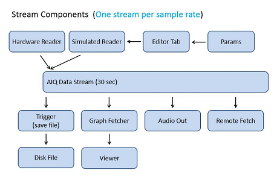
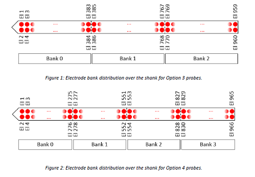

# SpikeGLX User Manual

**Topics:**

* [Overview]
    + [Screen Saver and Power Settings]
    + [Installation and Setup]
        + [Remote Command Servers]
        + [Run Directory]
    + [Data Stream]
    + [Supported Streams]
        + [Stream Length]
    + [Channel Naming and Ordering]
    + [Synchronization]
        + [Procedure to Calibrate Sample Rates]
        + [Running Without a Generator]
        + [Running With a Generator]
        + [Updating the Calibration]
* [Console Window]
* [Configure Acquisition Dialog]
    + [**Devices** -- Which Streams to Enable](#devices----which-streams-to-enable)
        + [IP Address]
    + [**IM Setup** -- Configuring Imec Probes](#im-setup----configuring-imec-probes)
        + [Global Settings]
        + [Per Channel Settings]
    + [**NI Setup** -- Configuring NI-DAQ Devices](#ni-setup----configuring-ni-daq-devices)
        + [Sample Clocks -- Synchronizing Hardware]
        + [Input Channel Strings]
        + [MN, MA Gain]
        + [AI Range]
    + [**Sync** -- Mapping Time Across Streams](#sync----mapping-time-across-streams)
        + [Square Wave Source]
        + [Input Channels]
        + [Calibration Run]
        + [Measured Samples/s]
    + [**Gates** -- Carving Runs into Epochs](#gates----carving-runs-into-epochs)
        + [Run -> Gate -> Trigger]
        + [Gate Modes]
        + [Gate Manual Override]
    + [**Triggers** -- When to Write Output Files](#triggers----when-to-write-output-files)
        + [Trigger Modes]
        + [Changing Run Name or Indices]
    + [**Maps**](#maps)
        + [Shank Map]
        + [Channel Map]
    + [**Save**](#save)
        + [Save Channel Subsets]
* [Graphs Window Tools]
* [Offline File Viewer]
* [Checksum Tools]

## Overview

### Screen Saver and Power Settings

The following settings guard against interruption during prolonged
data acquisition runs (running on batteries is discouraged):

Screen saver settings group:

* Screen saver: (None).

> Note 1: The screen saver settings are a control panel and you can get there
by typing 'screen saver' into a control panel search box. Screen saver is
a program that draws entertaining animation on your otherwise black screen.
The running of this class of programs disrupts acquisition. Turn that off.

> Note 2: In the power settings you can set the time until the screen turns
off. This is a safe option. It shouldn't affect anything except that you
may have to log in again after the screen blanks.

Power settings group:

* Put the computer to sleep: Never.
* Hard disk/Turn off hard disk after: Never.
* Sleep/Sleep after: Never.
* Sleep/Allow wake timers: Disable.
* USB settings/USB selective suspend setting: Disable.
* Intel(R) Graphics Settings/Intel(R) Graphics Power Plan: Maximum Performance.
* PCI Express/Link State Power Management: Off.
* Processor power management/Minimum processor state: 100%.
* Processor power management/System cooling policy: Active.
* Processor power management/Maximum processor state: 100%.

> Tip: For some settings, 'Never' might not appear as a choice. Try typing
either 'never' or '0' directly into the box.

### Installation and Setup

To install SpikeGLX on a new system, just copy a virgin SpikeGLX folder
to your C-drive and double click SpikeGLX.exe to begin.

> SpikeGLX is currently a 32-bit application. If you have any difficulty
launching it in 64-bit Windows, try:
>
> 1. Right-click on the application icon
> 2. Choose Properties
> 3. Compatibility Tab
> 4. Check : Run this program in compatibility mode for:
> 5. Select: Windows XP (Service Pack 3)

The contents of a virgin (see below) SpikeGLX folder:

```
SpikeGLX/
    ImecProbeData/
    platforms/
        qminimal.dll
        qwindows.dll
    icudt52.dll
    icuin52.dll
    icuuc52.dll
    libgcc_s_dw2-1.dll
    libNeuropix_basestation_api.dll
    libstdc++-6.dll
    libwinpthread-1.dll
    qt.conf
    Qt5Core.dll
    Qt5Gui.dll
    Qt5Network.dll
    Qt5OpenGL.dll
    Qt5Svg.dll
    Qt5Widgets.dll
    SpikeGLX.exe
    SpikeGLX_NISIM.exe
```

>Virgin: The SpikeGLX folder does not contain a `configs` subfolder.

#### Configs Folder

There are no hidden Registry settings or other components placed into your
system folders. Your personal preferences and settings will be stored in
`SpikeGLX/configs`.

>If you give the software to someone else (please do), delete the configs
folder because several settings in there are machine-dependent.

The configs folder is automatically created (as needed) when SpikeGLX
is launched.

>Tip: As you work with SpikeGLX you'll create several of your own custom
files to remember preferred settings {channel mappings, Imec readout tables, ...}.
**Resist the urge to store these in the SpikeGLX folder**. If you want to
upgrade, and, **we will add cool features over time**, the clutter will
make it much harder to figure out what you have to replace.

#### Remote Command Servers

Upon first launch SpikeGLX configures its **Remote Command** server and
**Gate/Trigger** server with a local-host (loopback) address. Also, the
Command server is disabled for security. You only need to think about
these settings if you intend to use the remote control features over a
network. In that case you need to visit their settings dialogs under the
`Options` menu. In most cases, clicking the `My Address` button will set
an appropriate interface (IP address) value, and you'll probably never
need to alter the default port and timeout values.

>Note: If your SpikeGLX address was assigned by a DNS service, it might
change if other machines are added or removed on the network. Just click
`My Address` again to read the updated value.

#### Run Directory

On first startup, the software will automatically create a directory called
`C:/SGL_DATA` as a default **Run folder** (place to store data files).
Of course, the C:/ drive is the worst possible choice, but it's the only
drive we know you have. Please use menu item `Options/Choose Run Directory`
to select an appropriate folder on your data drive.

You can store your data files anywhere you want. The menu item is a
convenient way to "set it and forget it" for those who keep everything
in one place. Alternatively, each time you configure a run you can revisit
this choice on the `Save` tab of the `Configure Acquisition` dialog.

### Data Stream

The following technical background will help you understand and configure
your system, and help explain data storage formats. A key concept is the
`data stream` which has several parts:



On the **input** side, stream-specific hardware acquires data at its own
characteristic sample rate and feeds that into a long stream buffer
(FIFO queue). This happens in a `reader thread`.

The enqueued data are then available to other **output** threads:

* The trigger module scans the stream for conditions you've specified and
then opens, writes and closes files accordingly.
* The graph fetcher pulls recent data from the stream and pushes it into
that stream's custom viewer.
* The Audio module fetches recent data for the sound driver.
* The Command server fetches data from the stream on behalf of remote
applications.

>Notes:
>
>**Each stream** gets its **own metadata and binary data files**.
>
>The file saving **Trigger unit is shared** between streams so that data
>files are better time synchronized.
>
>Likewise, the **GraphFetcher is shared** to facilitate synchronous data viewing.
>
>_More cores allow better load balancing among these activities._

### Supported Streams

In imec 'phase 3A' SpikeGLX supports two concurrent data streams that
you can enable independently each time you run:

1. `imec`: Imec probe data (operating over a custom Ethernet link).
2. `nidq`: Whisper/NI-DAQ acquisition from USB peripherals or PCI cards.

Imec probes read out up to 384 channels of neural data and have a 16-line
sync connector that's sampled (and recorded) at the neural data rate (30kHz).

An Nidq device (NI 6133 or 6366) can be used to record auxiliary, usually
non-neural, experiment signals. These devices typically offer 8 analog
and 8 digital channels. You can actually use two such devices if needed.

The Whisper system is a 32X multiplexer add-on that plugs into an NI device,
giving you 256 input channels.

#### Stream Length

To allow fetching of peri-event context data the streams are sized to hold
the smaller of {30 seconds of data, 60% of your physical RAM}. If a 30
second history would be too large you will see a message in the Console
window at run startup like: *"Stream length limited to 19 seconds."*

### Channel Naming and Ordering

#### Imec Channels

The Imec stream acquires **three distinct types** of channels:

```
1. AP = 16-bit action potential channels
2. LF = 16-bit local field potential channels
3. SY = The single 16-bit sync input channel
```

Option {1,2,3} probes read out 384 AP and LF channels, while option {4} probes
read out 276 AP and LF channels. In the help text our examples will assume
a 384-channel case.

Throughout the software the channels are maintained in `acquisition order`.
That is, each acquired **sample** (or **timepoint**) contains all 384 AP
channels, followed by the 384 LF channels, followed by the SY channel.

The channels all have names with two (zero-based) indices, like this:

```
AP0;0 .. AP383;383 | LF0;384 .. LF383;767 | SY0;768
```

For example, LF1;385 tells you:
- This is an LF channel
- It's the second channel in the LF group
- It's the 386th channel overall

The second "overall" index (after the semicolon) is the index you
should use for all GUI functions that select channels. For example:

* Which channel to observe in a TTL trigger.
* Which channel to send to audio output.
* Which channels to selectively save.

**Imec Data Files Are Split**

In memory, the LF channels are upsampled to 30kHz for symmetry with the
AP channels. However, for better disk efficiency the AP and LF data are
written out separately and the LF data have their natural sampling rate
of 2.5kHz.

If you elected to save all channels `YourFile.imec.ap.bin` would contain:

```
AP0;0 .. AP383;383 | SY0;768
```

and `YourFile.imec.lf.bin` would contain:

```
LF0;384 .. LF383;767 | SY0;768
```

Note that the sync channel is duplicated into both files for alignment in
your offline analyses. Note, too, that each binary file has a partner meta
file.

#### NIDQ Channels

There are four categories of channels {MN, MA, XA, XD} and these are
acquired and stored in that order, though they may be acquired from
either one or two NI devices (named say, 'dev1 and 'dev2').

```
1. MN = dev1 multiplexed neural signed 16-bit channels
2. (likewise from dev2)
3. MA = dev1 multiplexed aux analog signed 16-bit channels
4. (likewise from dev2)
5. XA = dev1 non-muxed aux analog signed 16-bit channels
6. (likewise from dev2)
7. XD = dev1 non-muxed aux digital unsigned 16-bit words
8. (likewise from dev2)
```

>Notes:
>
> 1. Within a multiplexed subgroup, like MN or MA, all the channels connected
>	to a given multiplexer are grouped together. The names of the channels
>	acquired from neural muxer #2 are "MN2C0"..."MN2C31". Zero-based labeling
>	is used throughout.
>
> 2. If a second device is used, each MN, MA, ... category  within the
>	central stream is seamlessly expanded as if there were a single
>	higher capacity device.
>
> 3. Channel names, e.g. "MA1C2;34" indicate both which channel this is
>   within its own category (here, the 3rd channel in group MA1) and,
>   which it is across all the channels in this stream (here, the 35th
>   channel in the stream). The latter index (34) is how you should refer
>   to this channel in save-strings, in trigger setups and for audio
>   out selection.
>
> 4. Up to 8 digital lines can be acquired from your main device (say, dev1)
>   and from a secondary device (say, dev2). If the XD box for dev1 and
>   for dev2 are both empty, no digital lines are acquired, and the stream
>   data will not have a digital word. If either XD box names lines to
>   acquire there will be one 16-bit digital word per timepoint with the
>   lower 8 bits holding dev1 data and the upper 8 holding dev2 data. The
>   Graphs Window depicts digital words with 16 lines numbered 0 through
>   15 (bottom to top).

### Synchronization

Each stream has its own asynchronous hardware clock, hence, its own **start
time** and **sample rate**. The time at which an event occurs, for example a
spike or a TTL trigger, can be accurately mapped from one stream to another
if we can accurately measure the stream timing parameters. SpikeGLX has
several tools for that purpose.

#### Procedure to Calibrate Sample Rates

1) A pulse generator is configured to produce a square wave with period of
1 s and 50% duty cycle. You can provide your own source, or SpikeGLX can
program the NI-DAQ device to make this signal.

2) You connect the output of the generator to one input channel of each
stream and name these channels in the `Sync tab` in the Configuration
dialog.

3) In the `Sync tab` you check the box to do a calibration run. This
will automatically acquire and analyze data appropriate to measuring
the sample rates of each enabled stream. These rates are posted for you
in the `Sync tab` for use in subsequent runs.

>Full detail on the procedure is found in the help for the
Configuration dialog's [`Sync tab`](#sync----mapping-time-across-streams).

#### Running Without a Generator

You really should run the sample rate calibration procedure at least once
to have a reasonable idea of the actual sample rates of your specific
hardware. In our experience, the actual rate of an imec stream may be
30,000.10 Hz, whereas the advertised rate is 30 kHz. That's a difference
of 360 samples or 12 msec of cumulative error per hour that is correctible
by doing this calibration.

The other required datum is the stream start time. SpikeGLX records the
wall time that each stream's hardware is commanded to begin acquiring
data. However, that doesn't account for the time it takes the command
to be transmitted to the device, to be decoded, to be responded to,
and for the first data to actually arrive at the device. This estimate
of the start time is only good to about 10 ms.

It is an option to do your data taking runs without a connected square
wave generator, and you might choose that if you only have one stream,
or if the sync hardware is malfunctioning for any reason. Under these
conditions runs will start off with time synchronization errors
of 5 to 10 ms (owing to T-zero error) and that error will slowly drift
depending upon how accurate the rate calibration is and whether the
stream has clock drift that isn't captured by a simple rate constant.
Thankfully, you can do much better than that...

#### Running With a Generator

In this mode of operation, you've previously done a calibration run to
get good estimators of the rates, and you are dedicating a channel
in each stream to the common generator during regular data runs. Two
things happen under these conditions:

1) When the run is starting up SpikeGLX uses the pulser to adjust the
estimated stream start times so they agree to within a millisecond.

2) During the run, the time coordinate of any event can be referenced
to the nearest pulser edge which is no more than one second away, and
that allows times to be mapped with sub-millisecond accuracy.

#### Updating the Calibration

Menu item: `Tools/Sample Rates From Run` lets you open any existing
run that was aquired with a connected generator and recalibrate the
rates for those streams. You can then elect to update the stated sample
rates within this run's metadata, and/or update the global settings
for use in the next run.

## Console Window

The `Console` window contains the application's menu bar. The large text
field ("Log") is a running history of informative messages: errors, warnings,
current status, names of completed files, and so on. Of special note is
the status bar at the bottom edge of the window. During a run this shows
the current gate/trigger indices and the current file writing efficiency,
which is a key readout of system stability.

### Ethernet Performance

The Xilinx board used with the Imec system has a 1GB FIFO buffer that
can hold ~50 seconds of probe data waiting to be pulled into the PC over
Ethernet. A fast running loop in SpikeGLX requests packets of probe data
and marshalls them into the central stream. Every 5 seconds we read how
full the Xilinx buffer is. If it is more than 5% full we make a report in
the console log like this:

```
IMEC FIFOQFill% 10.20, loop ms <1.7> peak 8.55
```

This indicates the current percent full, how many milliseconds the average
packet fetch is taking and the slowest fetch. If the queue grows a little
it's not a problem unless the percentage exceeds 95%, at which point the
run is automatically stopped.

### Disk Performance

During file writing the status bar displays a message like this:

```
FileQFill%=(0.1,0.0) MB/s=14.5 (14.2 req)
```

The imec and nidq streams each have an in-memory queue of data waiting to
be spooled to disk. The FileQFill% is how full each binary file queue is
(imec,nidq). The queues may fill a little if you run other apps or
copy data to/from the disk during a run. That's not a problem as long
as the percentage falls again before hitting 95%, at which point the
run is automatically stopped.

In addition, we show the overall current write speed and the minimum
speed **required** to keep up. The current write speed may fluctuate
a little but that's not a problem as long as the average is close to
the required value.

>**You are encouraged to keep this window parked where you can easily see
these very useful experiment readouts**.

### Tools

* Control report verbosity with menu item `Tools/Verbose Log`.
* Enable/disable log annotation with menu item `Tools/Edit Log`.
* Capture recent log entries to a file with menu item `Tools/Save Log File`.

## Configure Acquisition Dialog

Notes on the dialog as a whole:

* Settings are divided into subgroups on the various tabs. Validation
(a.k.a. sanity checking) is always performed on all of the settings on
all of the tabs. Validated settings are stored in `SpikeGLX/configs/daq.ini`.

* Press `Last Saved` to revert the entire dialog to the values in `daq.ini`.

* Press `Verify | Save` to sanity-check the settings on all tabs, and if
valid, save them to `daq.ini` **without** initiating a new run. This is
useful when trying to make the Configuration and Audio dialog settings agree
before starting a run, as audio settings are checked against `daq.ini`.

* Press `Run` to validate and save the settings to `daq.ini` and then
start a new run.

* Press `Cancel` to end the dialog session without further altering `daq.ini`.

## Devices -- Which Streams to Enable

Each time you visit the Configuration dialog you must go through the
`Devices Tab` and tell us which subsystems you want to use (enable). You also
have to press the `Detect` button which detects the hardware that's actually
connected. This allows the software to apply appropriate sanity checks to
your settings choices.

If you have already visited the Configuration dialog and pressed `Detect`
at least once before (without quitting the SpikeGLX application) then we
permit you the shortcut of pressing `Same As Last Time`. It is then your
own fault, though, if you in fact changed something without telling us.

### IP Address

The computer talks to the 3A imec system via Ethernet. Set the computer's
static IP address to `10.2.0.123`. Set the subnet mask to `255.0.0.0`.

## IM Setup -- Configuring Imec Probes

### Global Settings

Imec channels are separated into two filtered bands as follows:

* LF: [0.5..1k]Hz (fixed).
* AP: [{300,500,1k}..10k]Hz (selectable high pass).

### Per Channel Settings

Currently, a simple editor lets you load/save/edit a text file that specifies
all the choices you can make for each of the (up to) 384 readout channels
of the probe. The text file has extension `(.imro) = Imec readout`.

#### Save the file!

If you choose anything other than default settings, you must save the table
as a named file.

#### Bank

Option {1,2} probes have a fixed set of 384 electrodes in 1-1 correspondence
with the 384 readout channels. All electrodes are in bank zero.

Option {3,4} probes use switches to select the bank that each readout
channel is connected to. The relationships are these:

* Option 3: electrode = (channel+1) + bank*384; electrode <= 960
* Option 4: electrode = (channel+1) + bank*276; electrode <= 966



#### Refid

Each option {1,2,3} readout channel can be connected to 11 different
references, selected by indices [0..10]:

```
Refid  Referenced channel
0      external
1      36
2      75
3      112
4      151
5      188
6      227
7      264
8      303
9      340
10     379
```

Option 4 probes offer 8 reference choices [0..7]:

```
Refid  Referenced channel
0      external
1      36
2      75
3      112
4      151
5      188
6      227
7      264
```

>_Note that Refid values always select the readout channels shown...Which
electrode that will be depends upon the bank you have selected for the
referenced channel._

#### Gain

Each readout channel can be assigned a gain factor for the AP and the LF
band. The choices are:

```
50, 125, 250, 500, 1000, 1500, 2000, 2500
```

## NI Setup -- Configuring NI-DAQ Devices

### Sample Clocks -- Synchronizing Hardware

For all modes:

* A second device, if used, _always needs an external clock source_, and
that source must always be the same clock that drives device1. This is the
only way to coordinate the two devices. The NI breakout boxes, like
`BNC-2110`, make this simple.

* You will get the best possible alignment of data across your files
if you use the calibration features on the `Sync` tab to measure the
true sample rates of your devices.

* There is a `Start checkbox` and a selectable digital output line. If
enabled, when the run starts, the selected line goes from low to high
and stays high until the run is stopped. This is always an option you
can use to hardware-trigger other components in your experiment.
_(Whisper systems require this signal on line0)._

**{Clock, Muxing, Sample Rate}** choices depend upon your hardware--

#### Case A: Internal Clock Source, No Multiplexing

In this simple case, there is no external sample clock. Rather, you
can set the NI device to generate its own sample clock waveform.
Note that an NI device can achieve a precise value only if it evenly
divides the master clock rate. The master rate for a 6133 is 20 MHz
which is divisible by 40000 but not by 30000, for example.

* Set device1 clock = `Internal`. Device1 Ctr0 will be programmed as the
master clock using the sample rate you enter in `Samples/s`. The Ctr0
signal is available as an output from device1 (see the pin-out for your
device). On the NI BNC-2110 breakout box this is usually available at
terminal `P2.4`.
* _Optionally_ connect a wire from the device1 Ctr0 output pin to a selected
`PFI` terminal on device2.
* Leave the MN and MA channel boxes blank.
* Specify input channels in the XA and XD boxes.
* `Chans/muxer` is ignored for these channels.
* Set a `Sample/s` value.

#### Case B: External Clock Source, No Multiplexing

In this case, the sample clock is being driven by some component in
your setup, other than the NI device. Follow these steps:

* Set device1 clock = PFI terminal.
* Connect external clock source to that terminal.
* _Optionally_ connect same external clock to a device2 PFI terminal.
* Leave the MN and MA channel boxes blank.
* Specify input channels in the XA and XD boxes.
* `Chans/muxer` is ignored for these channels.

#### Case C: Whisper Multiplexer

If you specify any MN or MA input channels, the dialog logic assumes you
have a Whisper and automatically forces these settings:

* Device1 clock = `PFI2`.
* Start sync signal enabled on digital `line0`.

You must manually set these:

* Set `Chans/muxer` to 16 or 32 according to your Whisper data sheet.

#### Case D: Whisper with Second Device

Follow instructions for Whisper in Case C. In addition:

1. In the device2 box, select a PFI terminal for the clock.
2. Connect the "Sample Clock" output BNC from the Whisper to the selected
PFI terminal on the NI breakout box for device2.

> Note that the BNC should be supplying the multiplexed clock rate:
`(nominal sample rate) X (muxing factor)`.

### Input Channel Strings

The **{MN, MA, XA}** input fields work just like the page range field in
a print dialog. For example, "0,2:4,6" means you're using NI analog-input
(AI) channels {0,2,3,4,6}. If you are not using a particular category,
like MA, then leave that field empty.

Remember that channel ordering is important. In the central stream we want
all the MN channels (if any) to come first, followed by the MA, then XA then
XD channels. These groupings allow the software to know how to process the
channels: what gain to apply, what type of filter to use, what to name it,
and so on. When we acquire AI data from an NI card it returns data from
channel AI0 (if any) then from AI1, and so on. **Therefore**, we require
you to plug your neural multiplexers (MN's) into the lowest numbered AI
channels, then populate the next AI channels with your MA muxers, then
plug in any XA lines. For example, this is legal:

```
MN = 2,4  // don't have to start at zero, gaps are okay
MA = 5    // MA comes AFTER MN
XA = 7    // XA strictly AFTER MN and MA
```

>Note: The cabling of the Whisper system automatically routes multiplexers
to the proper AI channels, but to set up the dialog **you** still have to
know that your Whisper box has neural muxers on AI channels `0:5` and
aux multiplexers on channels `6,7` (for example).

#### Digital Strings

As with AI channel strings, the XD field takes a range string like
"0,2:4,6:7" but in this case the values are digital line numbers.

We currently support only the lower 8 bits (lines) of port-0 from each
device, so legal line numbers are [0..7]. Note that Whisper systems
reserve line 0 as an output line that commands the Whisper to start.

### MN, MA Gain

The multiplexers in your system may have a gain factor. In a typical
Whisper box, the MN channels route through Intan chips with a gain of 200
and the MA channels are handled by a unity gain muxer (see the data sheet
for your hardware).

The gain values you enter here **do not** affect values recorded in disk
files. They are only applied in the Graph window so that familiar,
unamplified voltages are plotted and reported in the graph statistics.

>Note that some trigger modes ask you to specify a threshold voltage. The
value you enter for a threshold should always be what you read directly
from the graph of that channel. The software will make any necessary
gain adjustments.

### AI Range

NI devices let you configure an expected voltage range for an analog channel,
say [-2.5..2.5] volts. The purpose of this is to improve your dynamic range,
a.k.a. voltage resolution. If you know in advance that none of your voltages
will exceed 2.1 volts, then choosing [-2.5..2.5] is better than [-5..5] because
you'll get twice the resolution in your measurements. However, the value 3.0V
would be pinned (saturated) at 2.5V which is bad. In that case, [-5..5] is
a safer choice. Generally, choose the smallest range compatible with your
instrument specifications.

>Note that other components in the chain may impose their own voltage
restrictions. For example, some MA channel banks on some Whisper models
saturate at 2.5V. It would be a bad idea to use such channels to read an
instrument making output in the range [0..3.3] volts.

## Sync -- Mapping Time Across Streams

### Square Wave Source

Choose `Disable sync corrections` to run without active alignment to edges
of a common square wave. The software will still apply the measured sample
rates stated in the boxes at the bottom of this tab.

Otherwise, any generator source should be programmed to form a simple
square wave with a 1 second period and 50% duty cycle. At this time you
have two choices for the generator:

* `Current NI acquisition device` will program your multifunction NI device
to produce the required waveform at pin PFI-13. Brian Barbarits will make
a simple breakout connector available to allow Whisper users to access
PFI-13. You still have to run a wire from PFI-13 to the appropriate channel
input connector.

* `Other high precision pulser` will not program an NI device. Rather, you
provide any waveform generator you like.

Whether using an external pulser or the NI device, the programmed (set)
period is 1 second, but the actual period may differ from that. If you
have measured the actual period of the generator's output with a high
precision frequency/period analyzer, then enter that value in the
`Measured period` box. If you have not measured it, enter **1** in the box.

### Input Channels

#### Imec

You can connect the square wave to any of the 16 pins of the sync
connector on the Imec BSC card. Each pin takes 0-5V TTL digital input.

#### Nidq

At this time, Whisper boxes do not allow access to digital inputs, so you
must connect the square wave to one of the multiplexed auxiliary analog
inputs (MA).

### Calibration Run

To do a run that is customized for sample rate calibration, check the box
in this item group and select a run duration. We can't tell you how long
is optimal. That depends upon how stable the clocks are and you can see
that for yourself by repeating this measurement to see how it changes over
time. It's probably a good idea to turn on power and let the devices
approach a stable operating temperature before calibrating. We can't tell
you how long that should be either. Our typical practice is 30 minutes
of warm up and 20 minutes of measurement time.

A calibration run will save data files to the current run directory
specified on the `Save` tab. The files will automatically be named
`CalSRate_date&time_g0_t0...`

### Measured Samples/s

When you do a calibration run (and it is successful) the results are
stored into the `daq.ini` file of your `configs` folder. The next time you
configure a run the results will automatically appear in these boxes.

You can manually enter values into these boxes if needed, say, if you've
swapped equipment and already know its rates from previous measurements.

To give you a sense of how much measured values differ from the nominal
rates, here's what we typically get:

* IM: 30000.083871
* NI: 25000.127240.

## Gates -- Carving Runs into Epochs

### Run -> Gate -> Trigger

The hierarchical **run/gate/trigger** scheme provides several options
for carving an experiment "run" into labeled epochs with their own data
files. The terms "gate" and "trigger" were chosen because they are
"Biology neutral". You decide if epochs are really 'windows', 'events',
'trials', 'sessions' or other relevant contexts.

1. You configure experiment parameters, including a `run folder` where all
the output files will be stored, a `run name`, a `gate` method and a `trigger`
method.

2. You start the run with the `Run` button in the Configure dialog. That means
the data acquisition devices begin collecting scans and the Graphs window
begins displaying streaming data. _(A run can also be configured and/or started
using TCP/IP from a remote application)._

3. Initially, the gate is low (closed, disabled) and no files can be written.
When the selected gate criterion is met the gate goes high (opens, enables),
the gate index is set to zero and the trigger criteria are then evaluated.

4. Triggers determine when to capture data to files. There are several
options discussed more fully in the next section. Triggers act only within
a gate-high epoch and are terminated if the gate goes low. **Gates always
override triggers**. Each time the gate goes high the trigger criterion
is evaluated anew. If using the manual override option, each time `Enable
Recording` is pressed the trigger criterion is evaluated anew.

5. When the selected trigger condition is met, a new file is created using
the naming pattern `run-path/run-name_g0_t0.nidq.bin`. When the trigger goes
low the file is finalized/closed. If the selected trigger is a repeating
type and if the gate is still high then the next trigger will begin file
`run-path/run-name_g0_t1.nidq.bin`, and so on within gate zero. (For Imec
data streams, the same naming rule applies, with `nidq` replaced by
`imec.ap` and/or `imec.lf`).

6. If the gate is closed and then reopened, triggering resets and the
next file will be named `run-path/run-name_g1_t0.nidq.bin`, and so on.

7. The run itself is always stopped manually, either from the SpikeGLX
GUI or from a remote application.

### Gate Modes

At present we have provided two simple gate methods:

* `Immediate Start`. As soon as the run starts the gate is immediately
set high and it simply stays high ("latches high" in electronics lingo)
until the run is stopped.

* `Remote Controlled Start and Stop`. SpikeGLX contains a "Gate/Trigger"
server that listens via TCP/IP for connections from remote applications
(like StimGL) and accepts simple commands: {SETGATE 1, SETGATE 0}.

### Gate Manual Override

You can optionally pause and resume the normal **gate/trigger** processing
which is useful if you just want to view the incoming data without writing
files or if you want to ability to stop an experiment and restart it
quickly with a
[new run name or changed gate/trigger indices](#changing-run-name-or-indices).
To enable manual override:

On the `Configure Dialog/Gates Tab` check `Show enable/disable recording button`.
The button will appear on the Graphs Window main `Run Toolbar` at run time.

If this button is shown you also have the option of setting the initial
triggering state of a new run to disabled or enabled.

>_Warning: If you opt to show the button and to disable triggering, file writing
will not begin until you press the `Enable` button._

>_Warning: If you opt to show the button there is a danger of a run being
paused inadvertently. That's why it's an option._

## Triggers -- When to Write Output Files

Rule 1: **A file is being written when the trigger is high**.

Rule 2: **Every binary (.bin) file has a matching (.meta) file**.

>To capture final checksum and size, the metadata are written when
the binary file is closed.

### Trigger Modes

* `Immediate Start`. As soon as the run starts the trigger is immediately
set high and it simply stays high ("latches high") until the run is stopped.
Select 'Immediate' mode for the gate and trigger modes to start recording
immediately without fussing about experiment contexts.

<!-- -->

* `Timed Start and Stop`. First, _optionally_ wait L0 seconds, **then**:
    + Latch high until the gate closes, or,
    + Perform a sequence:
        - Write for H seconds.
        - Idle for L seconds.
        - Repeat sequence N times, or until gate closes.

<!-- -->

* `TTL Controlled Start and Stop`. Watch a selected (analog or digital)
channel for a positive going threshold crossing, **then**:
    + Latch high until the gate closes, or,
    + Write for H seconds, or,
    + Write until channel goes low.
    + _Latter 2 cases get flexible repeat options_.
    + _Threshold detection is applied to unfiltered data_.

<!-- -->

* `Spike Detection Start and Stop`. Watch a selected channel for a negative
going threshold crossing, **then**:
    + Record a given peri-event window about that to its own file.
    + Repeat as often as desired, with optional refractory period.
    + _Threshold detection is applied post 300Hz high-pass filter_.

<!-- -->

* `Remote Controlled Start and Stop`. SpikeGLX contains a "Gate/Trigger"
server that listens via TCP/IP for connections from remote applications
(like StimGL) and accepts simple commands: {SETTRIG 1, SETTRIG 0}.

>Note that some trigger modes ask you to specify a threshold voltage. The
value you enter should be the real-world voltage presented to the sensor.
It's the same value you read from our graphs. For example, a threshold for
neural spikes might be -100 uV; that's what you should enter regardless
of the gain applied.

### Changing Run Name or Indices

First you must opt to show the `Enable/Disable Recording` button of the
Graphs Window Run Toolbar, using the [manual override options](#gate-manual-override).

In the `Graphs Window`, disable recording using the button. While paused, you can:

* Change the run name.

    In the text box next to `Enable Recording` enter a name different from
    the current run name. **Do not** adorn the name with gate/trigger indices
    of the form `runname_g12_t14`. Rather, the software detects that the
    run name is new and automatically resets the counters to: `_g0_t0`.

* Change the _g/t file index numbers.

    You can force the gate/trigger counters to resume at desired values
    by entering the current run name, adorned with the desired indices,
    for example `runname_g12_t14`. **Note that this feature does not check
    for pre-existing files with the resulting name**.

## Maps

### Shank Map

A `shank map` is a table describing where each neural channel is on your
physical probe. This information is used for spatial channel averaging,
and for activity visualization.

A rudimentary tool is provided to create, edit and save shank maps (and
shank map (.smp) files). Click `Edit` in the `Shank mapping` group
box for the map of interest.

> If you do not supply a map, the `default` layout depends upon the stream.
The **imec** default layout is a probe with 1 shank, 2 columns, and a row
count determined from your actual probe option and `imro` table choices.
The **nidq** default is a probe with 1 shank, 2 columns and a row count
equal to MN/2 (neural channel count / [2 columns]).

To make and use a custom map you must save it in a file. The file format
looks like this:

```
1,2,480     // header: nShanks,nColsPerShank,nRowsPerShank
0 0 0 1     // entry: iShank <space> iCol <space> iRow <space> iUsed
0 1 0 1
0 0 1 1
0 1 1 1
...         // one entry per spiking acquisition channel
```

This universal layout scheme has a few simple rules:

* Number of shanks is [1..8].
* Each shank has (nCols x nRows) sites.
* Shank indices (iShank) start at 0 and advance left to right.
* Column indices (iCol) start at 0 and advance left to right.
* Row indices (iRow) start at 0 and advance tip to tail.
* Each site has a `used` index (Boolean 0 or 1) denoting inclusion in spatial averages.

> You can mark a site `used=0` if you know it is broken or disconnected. For
Imec probes, we automatically set `used=0` for reference sites and those you
have turned off in the IM Setup tab.

**Most importantly** a shank map is a mapping from an acquisition channel
to a probe location. So...while there can be more potential sites
(nShanks x nCols x nRows) than channels...

* **The number of table entries must equal AP (if Imec) or MN (if Nidq).**

### Channel Map

The Graphs window arranges the channels in the standard `acquisition` order
(AP, LF, SY) and (MN, MA, XA, XD) or in a `user` order that you can
specify using a `channel Map`. Each stream gets its own map file.

A rudimentary tool is provided to create, edit and save channel maps (and
channel map (.cmp) files). Click `Edit` in the `Channel mapping` group
box for the map of interest.

> If you do not supply a map, the `default` user order is the same as
the acquisition order for that stream.

To make and use a custom map you must save it in a file. The file format
looks like this:

```
6,2,32,0,1   // header (type counts): MN,MA,C,XA,XD
MN0C0;0 256  // entry: channel-name;acq-index  <space>  sort-index
MN0C1;1 1
MN0C2;2 2
MN0C3;3 3
...
XD0;256 0    // this example makes the digital graph first
```

You can save and reuse channel map files in another run by loading that
file from the Channel Map dialog. However, this only makes sense if the
loaded map describes the same types and counts of channels as you've
configured in the current run, hence, the header values, which are counts
of channel types. The `C` value is the number of channels per muxer.

Editing the sort order simply consists of reordering the right-most column
of sort-index values which must be in the range [0..N-1], where N is the
total channel count. For digital data we don't count individual lines.
Rather we count 16-line blocks of channels.

> You can edit these files in any text editor if you prefer. You can
change channel name strings too (shh).

> You can also change the channel map from the Graphs window by right-clicking
on the graphs area and selecting `Edit Channel Order...`.

## Save

### Save Channel Subsets

The hardware configuration tabs determine which channels are acquired from
the hardware and held in the central data stream. All acquired channels
are shown in the Graphs window. However, you don't have to save all of the
channels to your disk files.

You can enter a print-page-range style string for the subset of channels
that you want to save. This string is composed of index numbers in the
range [0..N-1], where N is the total channel count. To save all channels
you can use the shorthand string `all`, or just `*`.

> You can also change this list from the Graphs window by right-clicking
on the graphs area and selecting `Edit Saved Channels...`.

## Graphs Window Tools

### Run Toolbar

* `Stop Acquisition`: Stops the current run and returns the software to an idle state.
You can do the same thing by clicking the `Graph Window's Close box` or by
pressing the `esc` key, or by choosing `Quit (control-Q)` from the File
menu (of course the latter also closes SpikeGLX).

* `Acquisition Clock`: The left-hand clock displays time elapsed since the run started
and first samples were read from the hardware.

* `Enable/Disable Recording`: This feature is available if you select it
on the Gates tab. Use this to [pause/resume](#gate-manual-override) the
saving of data files, to change [which channels](#save-channel-subsets)
are being written to disk files, or to
[edit the name](#changing-run-name-or-indices) of the run and its disk files.

* `Recording Clock`: The right-hand clock displays time elapsed since the current file
set was opened for recording.

* `Pause`: The Pause VCR-style button toggles between pause and play of
stream data in the graphs so you can inspect an interesting feature.
This does not pause any other activity.

### Stream Toolbar Controls

* `MN0C0;0`: The name of the currently selected graph. Single-click on
any graph to select it. The current graph is the target of several
controls such as the axis scaling boxes. Click on the channel-name
string in the toolbar to switch to the page containing the current selection.

* `Expand`: This button toggles between showing just the selected channel,
and the standard multi-channel view. You can also double-click a graph
to select it and expand/contract it.

* `Sec`: Enter a value in range [0.001..30.0] seconds to set the time span.

* `Yscl`: Enter a value in range [0.0..9999.0] to set a vertical magnification
for the selected graph.

* `Clr`: Click this button to get a Color picking dialog whereby you can
define an alternate color for the **data trace** in the selected graph.
This only works for analog channels; digital traces are auto-colored.

* `Apply All`: Copies Yscl from the selected graph to all other graphs
of the same category.

#### Filters Applied Only to Neural Channels

Notes:

* These filters only affect the appearance of graphs, not saved data.
* These filters are **not** applied to non-neural channels.
* If ever you are suspicious that hardware is not working, turn all the
filters off to understand what is coming out of the hardware.

##### General Filters

* `-<T>`: Time averaging. Samples the data stream per channel to calculate
and then subtract the time average value; effectively subtracting the DC
component. The value is updated every 5 seconds. This may create
artifactual steps during the initial settling phase of Imec preamps.

* `-<S>`: Spatial averaging. At each timepoint a neighborhood of electrodes
per channel is averaged; the result is subtracted from that channel. The
locations of electrodes are known from your shank map.
    + Notes:
        1. Certain electrodes are omitted from the average: {Those marked
        'use=false' in your map, Imec reference electrodes, Imec electrodes that
        are turned off}.
        2. Only AP-band channels are affected.
        3. Neighborhoods never cross shank boundaries.
    + There are four choices of neighborhood:
        + `Loc 1,2`: An annulus about the channel's electrode; inner radius=1,
            outer=2.
        + `Loc 2,8`: An annulus about the channel's electrode; inner radius=2,
            outer=8.
        + `Glb All`: All electrodes on this channel's shank.
        + `Glb Dmx`: All electrodes on this channel's shank that are sampled
            concurrently (same multiplexing phase).

* `BinMax`: If checked, we report the extrema in each neural channel
downsample bin. This assists spike visualization but exaggerates apparent
background noise. Uncheck the box to visualize noise more accurately.

##### Imec Stream Filters

* `AP=AP+LF`: Replaces the AP channel with the sum of the AP and its
corresponding LF channel data.

##### Nidq Stream Filters

* `Bandpass`: Applies optional bandpass filtering to neural MN
channels.

### Page Toolbar Controls

* `Acq/Usr Order`: This button toggles between acquired (standard)
channel order and that specified by your custom [channel map](#channel-map).

* `ShankView`: Opens the ShankViewer window for this stream.

* `NChan`: Specifies how many graphs to show per page.

* `1st`: Shows the index number of the first graph on the current page.

* `Slider`: Change pages.

### Right-Click on Graph

For either stream:

* `Select As L/R Audio Channel`: Listen to selected channel (immediately).

* `Edit Channel Order...`: Edit the ChanMap for this stream.

* `Edit Saved Channels...`: Edit the string describing which channels
are saved to file. Note that saved channels are marked with an `S` on the
right-hand sides of the graphs.

* `Color TTL Events...`: Watch up to 4 auxiliary (TTL) channels for
pulses. Apply color stripes to the graphs when pulses occur.

#### Imec Menu

* `Edit Banks, Refs, Gains...`: Shows the Imro Table editor allowing quick
settings changes (available only if recording currently disabled). If you
make changes to the bank values the software will automatically generate
a new default ShankMap reflecting your current electrode, reference and
on/off channel selections.

* `Edit Option-3 On/Off...`: Shows editor for changing which option-3
channels are turned off (available only if recording currently disabled).
The current ShankMap is updated to reflect your changes.

>*Note: In the Configuration dialog ChanMap Editor you can order the graphs
according to the extant ShankMap before the run starts. This is **not**
changed even if we dynamically alter the ShankMap in these R-click actions.*

### Other Graph Window Features

* Hover the mouse over a graph to view statistics for the data
currently shown.

## Offline File Viewer

Choose `File::Open File Viewer` and then select a `*.bin` file to open.
As of version 20160701 you can open and view data files from any stream,
and you can link the files from a run so scrolling is synchronized between
multiple viewers.

In a viewer window, choose `Help::File Viewer Help` for more details.

## Checksum Tools

### SHA1 Checksum

Each .meta file stores the SHA1 checksum for the binary file in the field
`fileSHA1=`. Use menu item `Tools/Verify SHA1` to recalculate the current
value for any (.bin,.meta) pair and determine if either file may have been
corrupted. The SHA1 checksum, per se, does not provide any pathway to recovery.

### PAR2 Redundancy Tool

Of course, you can create a perfect backup of a file by simply copying it
whole, and that's the recommended thing to do provided you can afford the
storage space.

Alternatively, _**P**arity **AR**chive 2_ is a Usenet format for detecting and
correcting binary file corruption using only a fraction of the original
file's size. `(That fraction is called the redundancy percentage.)` The downside
is that the smaller the fraction you use for the backup set, the lower the
likelihood of being able to fully recover the original file.

To invoke the tool use menu item `Tools/PAR2 Redundancy Tool` to create a
backup set for a given data file. Subsequently, using the same tool, you
can use the backup set to verify the file and to attempt recovery in case
of corruption.


_fin_

