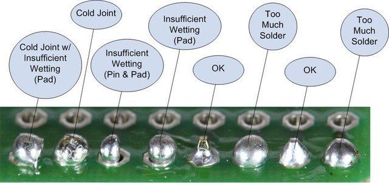

# Noise: Learn How To Solder

## Overview

Imec probes as shipped to you generally meet their noise specs: `6-8 uV RMS`.

Noise above that is in your own setup/environment. There are many possible
sources of noise in the world, but all too often we have traced excessive
noise to bad soldering of the `reference` or `ground` connections at
(or near) the probe. Such effects can show up with a wide range of
amplitudes and frequencies, but tend to be common to most channels.

The probes are super sensitive differential voltage meters. A bad solder
joint on the reference path will have high (possibly variable) resistance.
This causes measurements to float and wander. Similarly, a poor connection
of the amplifier ground causes unpredictable circuit performance.

> It is essential to make good wiring connections at the probe and at
other points such as a skull screw.

## What to look for

Following image unmodified and courtesy of
[Bill Earl, adafruit.com.](https://learn.adafruit.com/assets/1978)

> Look at your connections! Do they honestly look alright?

## How to solder

Read all the truly excellent instructions at
[adafruit.com: Guide To Excellent Soldering](https://learn.adafruit.com/adafruit-guide-excellent-soldering/tools).

We've added some emphasis and a few extra tips below.

## Tips

* **Spread the flex arms**: The biggest risk to the probe is touching the
iron directly to the leads in the central part of the flex. Avoid that by
speading the target arm away from the center. Securely hold the flex so it
won't shift while trying to solder. Keep the hot iron away from the center
by approaching from the exterior side of the cable.

* **Practice first**: If you're at all nervous about doing this right, and
who isn't?, then by all means practice soldering some wires or inexpensive
resistors onto an old printed circuit board. Next extend your soldering
practice to flex cable which doesn't heat as easily as standard printed
circuit board. Use a dummy probe if you have one to spare. Get the hang
of it first. Maybe somebody else in your lab is just better at it than
you are. Make them do it. Buy them a beer after.

* **Use the right wire**: Use wire with adequate conductivity like copper or
silver. Stainless steel, for example, does not conduct heat very well making
it hard to wet with solder. Solder won't stick to it. Validate your choice
using a scrap of that wire to see if it heats and melts solder.

* **Use the right solder**: Lead is nasty, but quite honestly, you want to
use solder with about a 60/40 ratio of tin/lead because it melts and flows
at a low enough temperature to prevent damaging the probe.

* **Use the right iron**: Use an iron with settable temperature so you can
get the joint hot enough but not overheat it. Set it to about 700 F. Also
use an iron with switchable tips. You want a tip that is both clean, and
appropriately sized to adequately heat the target wire and pad, but nothing
else.

* **Make sure the parts are clean**: The pad, wire and tip of the iron should
be free of oils, plastics or other contaminants.

* **Tin the tip of the iron**: (1) Clean the tip: Coat it with solder and
immediately wipe it off again using the moistened sponge that comes with
the solder station. The tip should look shiny and bright all over. (2) Melt
a tiny fresh bead of solder onto the tip, just enough to get heat flowing
when you touch it to the joint.

* **Heat the joint, not the solder**: Never drip molten solder onto a joint.
Heat the joint up so solder flows onto and adheres to the joint as you touch
it to the wires. Try not to touch the iron itself, that's cheating. However,
sometimes you need to wet the tip a little better by adding a touch more of
solder to the iron so it makes better contact.

* **Get it hot enough**: It's hot enough when touching solder to the wire
makes it melt and flow easily. Yes the probe is expensive and the iron is hot.
You'll be super nervous, but you still have to get the connection hot
enough to flow the solder or your expensive probe will not work.

* **Keep still while it cools**: After removing the iron, the joint and
solder will cool in 2 to 3 seconds. **Don't move while it cools.** If
you disturb the work during those few seconds you'll diminish the contact
surface area, hence, the conductivity of the joint.

_fin_

