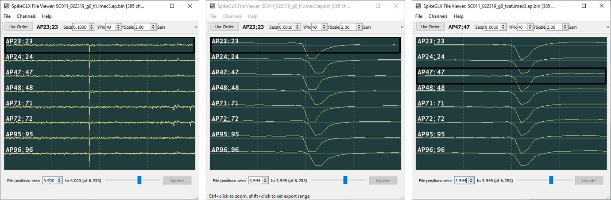
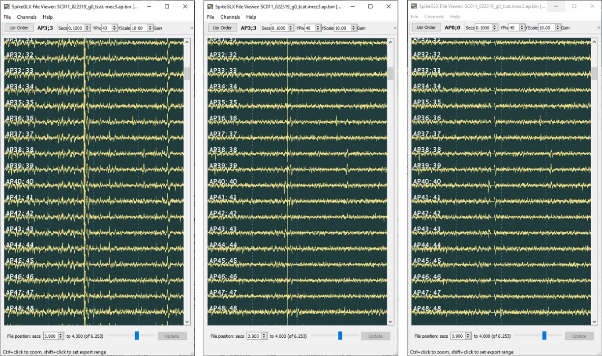

# CatGT: Tshift, CAR, Gfix

## Tshift

Imec probes digitize the voltages on all of their channels during each
sample period (~ 1/(30kHz)). However, the converting circuits (ADCs) are
expensive in power and real estate, so there are only a few dozen on the
probe and they are shared by the ~384 channels. The channels are organized
into multiplex channel groups that are digitized together, consequently each
group's actual sampling time is slightly offset from that of other groups.

CatGT automatically applies an operation we call `tshift` to undo the
effects of multiplexing by temporally aligning channels to each other.
This improves the results of operations that compare or combine different
channels, such as global CAR filtering or whitening. The FFT-based correction
method was proposed by Olivier Winter of the International Brain Laboratory.

**Figure:**
Licking artifact (fast transient on all channels), 1200 uV full-scale:

Figure panels (from SpikeGLX FileViewer):

- Left: Raw traces; 100 ms time span.
- Middle: Raw traces zoomed-in; 1 ms time span.
- Right: Aligned by CatGT tshift; 1 ms time span.

## Artifact Corrections {CAR, Gfix}

**CAR (CatGT -gblcar option)**

Global common average referencing (CAR) calculates (for each sample) the
average over all channels, and then subtracts that from each channel. This
does a great job of cancelling artifacts that are indeed similar on all
channels and that haven't saturated on any channels.

**Zeroing (CatGT -gfix option)**

Sometimes the hardware experiences a large electrical insult that affects
all channels in a nonunifom way. This may arise from licking, chewing,
head banging or laser stimulation events. In these cases CAR won't
work as well. CatGT can detect these events and replace them with zeros.

This option is specified, for example, as follows: `-gfix=0.40,0.10,0.02`.
This requires that a transient artifact must attain a peak amplitude of at
least ||0.40 mV||, must reach its peak as least as rapidly as ||0.1mV/sample-tick||,
and the transient is over when the amplitude settles back to ||0.02 mV|| or smaller.

> These values are easy to read by inspecting examples with the SpikeGLX FileViewer.

Furthermore, at least 25% of the channels must show a transient with these
characteristics. Such timepoints are flagged. After all other filtering has
been applied, the data are edited to replace the artifact span with zeros
in all channels.

It does make sense to use -gblcar and -gfix options together. Editing
removes extreme artifacts completely, while CAR removes common background
noise at all timepoints, not just at extrema.

**Figure:**
Variety of artifacts spanning all channels, 240 uV and 100 ms full-scale:

Figure panels (from SpikeGLX FileViewer):

- Left: Uncorrected.
- Middle: -gblcar; Smaller artifacts removed.
- Right: -gblcar -gfix; All artifacts removed.

## What Happened to Global Demux?

Before version 2.2, and before tshift was implemented, CatGT offered a
-gbldmx option. This separated the channels into groups that are sampled
concurrently so suffer no time shifts within the group. CAR was performed
on a group by group basis which often outperformed CAR on all channels.
Because the number of channels in a multiplex group was small the averages
were noisier than we can achieve by tshifting all channels into one large
group and applying CAR after that.

Moreover, tshifting the data improves the results of other downstream
operations like whitening and average waveform spread.

## What about CatGT loccar?

CatGT offers the option to do local CAR over a ring of channels. The idea
is that for each channel a disk is used to average the signal of neighbor
channels, but an inner disk (containing a potential spike footprint) is
excluded from the average. You get to specify the inner and outer disk
radii in units of channels.

The downsides to this are:

- Its hard to tune the disk sizes to the actual spike footprints, especially
if the probe spans several brain regions with different characteristic
neuron sizes, and considering that neurons are at a variety of distances
from the probe.

- Although loccar appears to have good noise reduction, more often than
not the true spike amplitude is more severely attenuated because the
footprint is larger than you expect.

Use loccar only if you already gave gblcar a fair chance.

## What about LFP?

Tshift is valuable for aligning LFP channels. CAR is not recommended when
analyzing low freqencies: LFP varies slowly over the whole shank, making
distant channels a bad reference for correcting noise.

_fin_

