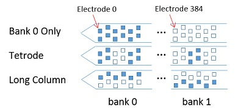

# SpikeGLX Download Page

**Synchronized acquisition from Imec neural probes and NI-DAQ devices.**

* Get compiled apps, support and help stuff on this page.
* See what's new on the site [here](new.md).
* The source code repo is [here](https://github.com/billkarsh).

>This site supports prototype and currently shipping commercial products.</BR>
>The latest commercial PXI-based components are:
>
>* Hardware: `Neuropixels 1.0 probes` (also called phase3B2).
>* Software: `SpikeGLX 3.0` (also called phase30).

------

## What Is SpikeGLX?

SpikeGLX is a recording system for extracellular neural probes. The emphasis
is on concurrent synchronous recording from high channel count probes together
with numerous auxiliary analog and digital channels:

* Concurrent, synchronized acquisition from Imec probes, Oneboxes and NI-DAQ devices.
* Supports all Neuropixels probe generations and types.
* Supports HHMI/Whisper system.
* Flexible visualization, filtering and sorting tools.
* Programmable triggering.
* Remote control and extensibility via C++ or MATLAB.
* Powerful offline viewing and editing.

------

## System Requirements
**(What to Buy)**

Requirements differ according to platform:

* [For PXI-based setups](https://github.com/billkarsh/SpikeGLX/blob/master/Markdown/SystemRequirements_PXI.md).
* [For all earlier setups](https://github.com/billkarsh/SpikeGLX/blob/master/Markdown/SystemRequirements_Xilinx.md).

>*Important!: The enclustra drivers required for PXI do not work with
AMD-based computers. The PXI-based imec hardware can only run on computers
using Intel CPUs and chipsets.*

>*Important!: Currently shipping imec modules are programmed to work only
in X4 and higher chassis slots. Learn more about this issue on the site's
[Firmware tab](firmware.md).*

------

## Latest Application Downloads

**SpikeGLX 3.0 (PXI, all probe types later than 3A)**:

Latest release highlights:

- Replaces all previous releases.
- Supports all probes.
- Does whole probe activity surveys.
- Has cool graphical site selection tools.
- Supports the (now separate) MATLAB and C++ remote SDKs.
- Has many GUI enhancements and better help.

>Important: Please read the `README` file for instructions regarding imec
firmware versions.

* [Release 20230411-phase30](App/Release_v20230411-phase30.zip)...[Readme](Readme/Readme_v20230411-phase30.txt) : 2.0 probes, Fix PH2B headstage, Imec v3.60

**Xilinx Kintex versions not covered by 3.0**:

* [Release 20190724-phase3B1](App/Release_v20190724-phase3B1.zip)...[Readme](Readme/Readme_v20190724-phase3B1.txt) : Minor bug fixes, Imec v5.1
* [Release 20190724-phase3A](App/Release_v20190724-phase3A.zip)...[Readme](Readme/Readme_v20190724-phase3A.txt) : Minor bug fixes, Imec v4.3

>Suggested organization: Create folder 'SpikeGLX' on your desktop or `C:\`
then download/unzip associated stuff into it. It's fine to have several
versions there as long as you run one at a time:

```
SpikeGLX\
    Release_v20230411-phase30.zip
    Release_v20200520-phase3B2.zip
    Release_v20230411-phase30\
    Release_v20200520-phase3B2\
    Drivers\
        Enclustra_Windows_10&11\
    Tools\
    Etc\
```

------

## PXI Enclustra Drivers

These required driver files are not included in your SpikeGLX release.

1. Click the link below for your Windows OS version.
2. Unzip the folder into your local folder of SpikeGLX-related stuff.
3. Follow the installation ReadMe in the download.

>Terminology: 'Enclustra' is a company that markets other vendor's FPGAs
along with development and support tools. There are several FPGAs used in
the Neuropixels hardware, including a Xilinx Zynq model, often referred to
as 'the enclustra'.

* [Windows 7 & 8](Support/Enclustra_Win7&8.zip)
* [Windows 10 & 11](Support/Enclustra_Win10&11.zip)

>Important!: The enclustra drivers required for PXI do not work with AMD-based computers. The PXI-based imec hardware can only run on computers using Intel CPUs and chipsets.

------

## Remote Control/Scripting SDK

*Note:<br>
SDK = Software Development Kit<br>
API = Application Programming Interface*

SpikeGLX can be driven in real time by your own remote C++ or MATLAB
application. The API uses the TCP/IP protocol. Your custom application
can run on a separate computer (on the same network as SpikeGLX) or on
the same computer. The API allows you to:

* Set/get parameters.
* Start/stop runs.
* Fetch data with low latency (<5 ms on same computer).
* Do many things you can do from the SpikeGLX GUI.

Before SpikeGLX version 20220101 the MATLAB SDK was included in every
SpikeGLX download package.

As of SpikeGLX version 20220101 the C++ and MATLAB SDKs have been
made separate downloads available at the source code repo [here](https://github.com/billkarsh).

## HelloSGLX (Windows)

The C++ and MATLAB SDKs are full featured and support developers writing
C++ and MATLAB applications. If you are writing in Python, C# or other
languages, you can use HelloSGLX instead. This is a command-line application
that stands in between your script and SpikeGLX. For each command or query,
your script uses its shell commands to launch HelloSGLX as a separate
process. This is too slow for real-time data interaction, but still supports
easy integration of SpikeGLX into an automated workflow. You can get/set run
parameters and start/stop runs and file writing. Get it [here](https://github.com/billkarsh).

*Note that all of these SDKs require SpikeGLX 20220101 or later.*

------

## Command-line Tool Installation

* CatGT
* TPrime
* NIScaler
* C_Waves
* OverStrike

These come as zip files. To install one:

1. Extract the contained folder to any destination you like.
2. Keep the folder contents together, as you do with the SpikeGLX folder.
3. Read the contained `ReadMe.txt` for instructions.
4. Look at the `runit.bat` example batch script.

------

## CatGT

CatGT is a command-line tool that does the following offline operations
on SpikeGLX output files (all probe types):

>+ Optionally join trials with given run_name and index ranges [ga,gb] [ta,tb]...
>+ ...Or run on any individual file.
>+ Optionally apply demultiplexing corrections.
>+ Optionally apply band-pass and CAR filters.
>+ Optionally edit out saturation artifacts.
>+ By default extract tables of sync waveform edge times to drive TPrime.
>+ Optionally extract tables of other nonneural event times to be aligned with spikes.
>+ Optionally join the above outputs across different runs (supercat feature).
>+ [CatGT: Tshift, CAR, Gfix](help/catgt_tshift/catgt_tshift.md)

* [CatGT 4.2 (Windows)](Support/CatGTWinApp.zip)
* [CatGT 4.2 (Linux)](Support/CatGTLnxApp.zip)

------

## TPrime

TPrime is a command-line tool that maps event times (all probe types):

>+ Map time from one SpikeGLX data stream to any other.
>+ Translate all events to a single common timeline.
>+ Uses sync edges to achieve 1 to 2 sample accuracy.
>+ Maps TTL events extracted using CatGT.
>+ Maps spike times from any sorter.
>+ [Sync: Aligning with Edges.](help/syncEdges/Sync_edges.md)

* [TPrime 1.8 (Windows)](Support/TPrimeWinApp.zip)
* [TPrime 1.8 (Linux)](Support/TPrimeLnxApp.zip)

------

## Post-processing Tools

NIScaler command-line tool to calibrate/rescale NI analog voltages acquired
with SpikeGLX versions earlier than 20220101. SpikeGLX versions 20220101 and
later automatically acquire scaled data.

>*Note: Only the Windows NIScaler tool can scan NI hardware and create
calibration files. Both tools can apply calibration files to existing runs.*

>*Measured correction size: {6133=0%, 6363=5%, 6341=7%}.*

* [NIScaler 1.1 (Windows)](Support/NIScalerWinApp.zip)
* [NIScaler 1.1 (Linux)](Support/NIScalerLnxApp.zip)

MATLAB and Python tools for parsing SpikeGLX meta and binary datafiles (supports 3A, 3B1, 3B2, 20).

* [SpikeGLX_Datafile_Tools](https://github.com/jenniferColonell/SpikeGLX_Datafile_Tools)

MATLAB and Python tools that augment SpikeGLX metadata:

>+ Generates channel map files needed by Kilosort and JRClust (all SpikeGLX versions).
>+ Makes SpikeGLX data compatible with SpikeInterface (needed for versions prior to 20230326).
>+ Works for all probe types.

* [SGLXMetaToCoords](https://github.com/jenniferColonell/SGLXMetaToCoords)

Average cluster waveforms and statistics command-line tool. This can be run separately
like CatGT or used with
[ecephys_spike_sorting](https://github.com/jenniferColonell/ecephys_spike_sorting).

* [C_Waves 2.5 (Windows)](Support/C_WavesWinApp.zip)
* [C_Waves 2.5 (Linux)](Support/C_WavesLnxApp.zip)

*Jennifer Colonell's* version of the *Allen Institute ecephys_spike_sorting*
pipeline. This Python script-driven pipeline chains together:
CatGT, KS2, Noise Cluster Tagging, C_Waves, QC metrics, TPrime.

* [ecephys_spike_sorting](https://github.com/jenniferColonell/ecephys_spike_sorting)

Overwrite nasty parts of your binary data with zeros using OverStrike. This
helps remove artifacts that are too tricky for CatGT.

* [OverStrike 1.0 (Windows)](Support/OverStrikeWinApp.zip)
* [OverStrike 1.0 (Linux)](Support/OverStrikeLnxApp.zip)

------

## Interesting Map Files

* [Tetrodes Bank Selection 3B](Support/TetrodePattern_3B.zip) (tetrodes covering banks zero and one)
* [Long Column Bank Selection 3B](Support/LongColPattern_3B.zip) (one column through banks zero and one)



Related help:

* [IMRO Table Anatomy](help/imroTables.md)

------

## Metadata Guides

Descriptions of metafile items for each phase:

* [Metadata_30](Sgl_help/Metadata_30.html)
* [Metadata_20](Support/Metadata_20.html)
* [Metadata_3B2 (NP 1.0)](Support/Metadata_3B2.html)
* [Metadata_3B1](Support/Metadata_3B1.html)
* [Metadata_3A](Support/Metadata_3A.html)

------

## Questions or Problems?

1) For general How-To questions please consult the help documents and videos
on this site, or pose your question to the
[Neuropixels slack channel](https://join.slack.com/t/neuropixelsgroup/shared_invite/zt-1jibcdbhe-uNyp8q522L4S0apVKwoC6A)
so everyone can learn together.

2) If the community can't help, try emailing me directly. I'm also happy
to hear about new feature requests, and very eager to hear about suspected
bugs. This is the best way to let me know there's a possible issue without
causing alarm in the whole community. You can get my email from the About
Box in the SpikeGLX application.

3) As a last resort you can register your observations of serious
bugs/mistakes/errors using the SpikeGLX issue list on GitHub.

------

## Help

* [Neuropixels Slack Channel](https://join.slack.com/t/neuropixelsgroup/shared_invite/zt-1jibcdbhe-uNyp8q522L4S0apVKwoC6A)
* [Neuropixels Support Page](https://www.neuropixels.org/support)
* [Noise: Learn How To Solder](help/solder/solder.md)
* [Sharpening Apparatus (MS.Word.docx)](Support/NPix_sharpening.docx)
* [Installing NI Drivers](help/NIDriverInstall/NI_driver_installation.md)
* [SpikeGLX UserManual](Sgl_help/UserManual.html)
* [SpikeGLX QuickRef (MS.PowerPoint)](Support/SGLX_QuickRef.zip)
* [SpikeGLX FAQ](Sgl_help/SpikeGLX_FAQ.html)
* [CatGT: Tshift, CAR, Gfix](help/catgt_tshift/catgt_tshift.md)
* [Sync: Aligning with Edges](help/syncEdges/Sync_edges.md)
* [Parsing Data Files](help/parsing.md)
* [IMRO Table Anatomy](help/imroTables.md)

------

## How-to Videos

* [Handle & Solder](https://vimeo.com/315542037)
* [Sharpen Probe](https://vimeo.com/359133527)
* [Install Software](https://vimeo.com/316017791)
* [First Run](https://vimeo.com/322145679)
* [Sync](https://vimeo.com/322974285)
* [Graphical Probe IMRO Editor](https://vimeo.com/781678605)
* [Whole-Probe Activity Survey](https://vimeo.com/783581937)

------

## Licensing

Use is subject to Janelia Research Campus Software Copyright 1.2 license terms:
[http://license.janelia.org/license](http://license.janelia.org/license).

QLed components are subject to GNU Library GPL v2.0 terms, which are described here:
[https://github.com/billkarsh/SpikeGLX/blob/master/QLed-LGPLv2-LICENSE.txt](https://github.com/billkarsh/SpikeGLX/blob/master/QLed-LGPLv2-LICENSE.txt).


_fin_

